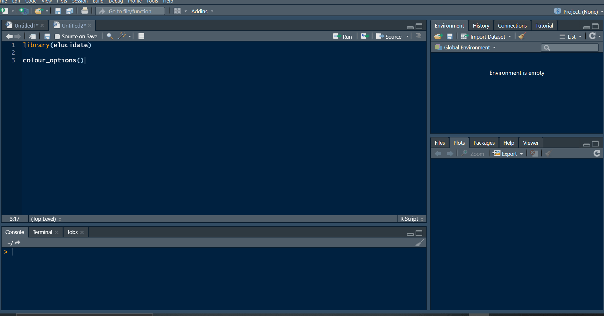

# **TL;DR**

This post dives into the [elucidate](https://github.com/bcgov/elucidate) package and how it can help you explore data using sets of functions for interrogating, describing, visualising, interacting with, and correcting data. This is a key stage of any analysis where errors are found and interesting relationships begin to appear.


# **Introduction**

The 10th post of the [Scientist's Guide to R series](https://craig.rbind.io/post/2019-05-17-asgr-basic-workflow/) takes us on a journey of discovery through data exploration. It's going to be an epic journey too because of how much there is to cover. In data science, sometimes you can even learn enough in this stage of an analysis to answer basic research questions. Read on to see how straightforward exploratory data analysis (EDA) can be with a new R package I created called [elucidate](https://github.com/bcgov/elucidate).  

`elucidate` helps you *explore* data by making it easy and efficient to:

1. **Interrogate** data in search of anomalies with `copies()`, `dupes()`, and `counts*`.

2. **Describe** data with the `describe*` set of functions for obtaining summary statistics, bootstrapping confidence intervals, and detecting missing values. 

3. Quickly **visualise** data with the `plot_*` set of functions.

4. **Interact** with data representations using the `static_to_dynamic()` function.

5. **Correct** data entry errors, anomaly indicator values, and structural inconsistencies seen in real world data more easily using `wash_df()` and `recode_errors()`. Here we blur the lines a bit between transformation and EDA, because data prep is usually an iterative cleaning/exploring process in practice. 

`elucidate` is a package I've been thrilled to be developing for the Research Branch of the [British Columbia Ministry of Social Development & Poverty Reduction](https://www2.gov.bc.ca/gov/content/governments/organizational-structure/ministries-organizations/ministries/social-development-poverty-reduction) since I started working as a public servant last spring^[R (or python) programming really is one of those *transferable research skills* that eventually does pay :moneybag: if you stick with it... on top of all the time you'll find yourself saving by ["automating the boring stuff"](https://automatetheboringstuff.com/). If you're currently a grad student, you can learn about some of the other highly marketable skills you're developing [here](https://beyondprof.com/10-transferable-skills-from-your-phd-that-employers-want/).]. Although I only spend a small fraction of my time on `elucidate`, I'm incredibly grateful for the BC Gov's ongoing support of the project so I can continue building it for all of us. 

Inspired by tidyverse naming conventions, many `elucidate` function are organized into sets that begin with a common root (e.g. `describe*`, `plot_*`, `counts*`), since this lets you see them all as suggestions while coding in R studio after typing the first three characters of the function or object name. It also facilitates code completion via the `tab` key. 

Many `elucidate` functions also accept a data frame as the 1st argument and return a data frame (or `ggplot`) as output, so they are compatible with the [pipe operator](https://craig.rbind.io/post/2019-12-30-asgr-2-1-data-transformation-part-1/#chaining-functions-with-the-pipe-operator) (`%>%`) from the [magrittr](https://magrittr.tidyverse.org/) package for easy integration into ["tidy"](https://r4ds.had.co.nz/tidy-data.html) data processing pipelines. 

**Bonus!** I recently saw a great [twitter thread](https://twitter.com/lisalendway/status/1312097209752711169?s=20) on how to capture screen recordings and include them in R markdown^[[R markdown](https://bookdown.org/yihui/rmarkdown-cookbook/) is what I'm using to write these posts, you'll learn much more about it when we get to the reporting & communication part of the guide] docs, so I'm going to try them out in this very post.

**Disclaimer:** This post covers ways of using R to get descriptive statistics, such as the sample mean, standard deviation, and skewness for numeric variables. I'm going to assume that you learned what these are and how to calculate them in an undergraduate introductory statistics course. If these terms are unfamiliar to you and/or statistics seems scary as a topic in general, I strongly recommend visiting Brown University's awesome [Seeing Theory website](https://seeing-theory.brown.edu/) before proceeding. 

# **Installation & Setup**

Because it is still rapidly evolving, `elucidate` is not on [CRAN](https://cran.r-project.org/web/packages/) yet (maybe in 2021); so you can't install it the normal way with `install.packages()`. 

Instead, like the *development versions* of many other packages, you can get it from [github](https://github.com/) with:

```{r, eval = FALSE}
install.packages("remotes") #only run this 1st if you haven't installed remotes before

remotes::install_github("bcgov/elucidate") 

#note: if you have trouble installing or updating some of the dependencies when
#installing a package from GitHub, try (re)-installing their CRAN versions (if
#available) 1st using install.packages().
```

Then just load it like any other R package, with the `library()` function:

```{r, cache = TRUE}
library(tidyverse) #for comparisons & the glimpse function

library(janitor) #for comparisons

library(bench) #for benchmarking

library(elucidate)

#also set the random generator seed for reproducibility
set.seed(1234)
```

For this post, we'll use the generated dataset, `pdata` (short for *p*ractice *data*), that is imported with `elucidate`. 

# **Interrogating Data**

As usual, we'll start by inspecting the structure of it with [dplyr::glimpse()](https://craig.rbind.io/post/2019-08-06-asgr-2-0-basic-operations-and-data-structures/#functions-for-describing-the-structural-information-of-data-objects).

```{r, cache = T}
glimpse(pdata)
```
This tells us that we've got 12,000 rows and 10 columns of various classes to work with including an "id" and date ("d") column that could represent distinct observations. 

Instead of 12,000 rows, let's over-sample it with replacement so that there are 1,000,000 rows to allow the performance of `elucidate` functions to be more realistically evaluated.

```{r, cache = T}
pdata_resampled <- pdata[sample(1:nrow(pdata), 1e6, replace = TRUE),]

dim(pdata_resampled) 
```
## checking for row `copies()` and `dupes()`

`dplyr::glimpse()` is a great first step in the data interrogation process. After learning about the columns names classes, dimensions, and previewing some of the data, the next thing I usually check is how many copies I have of each row based on columns like subject ID # and date, where I'm hoping that there are as many copies as I should find (i.e. one row per ID and date combination, representing unique measurements). Usually this means making sure there aren't any unexpected row duplicates. This can easily be checked with `elucidate::copies()`.

```{r, cache = T}
pdata_resampled %>% 
  copies() %>% 
  glimpse() #glimpse() again to show all output columns
```

You can see that the default version of `copies()` simply returns the input data with the addition of two columns called "copy_number" (which copy the rows is if multiple copies were detected) and "n_copies" (total number of row copies detected)^[The "copy_number" column is only provided for the default filter = "all" version of `copies()`, since this is when knowing the specific copy number is most useful (i.e. to facilitate subsequent [subsetting](https://craig.rbind.io/post/2019-12-30-asgr-2-1-data-transformation-part-1/#filter)). Following similar logic, the "n_copies" column is only provided when the filter argument is set to "all" or "dupes" because the other options ("first", "last", and "unique") drop all rows with more than one copy, meaning that the "n_copies" column would contain only values of 1.]. 

In this case, I've resampled the same data quite a lot, so there are multiple copies of all original rows. `copies()` will also preserve the original ordering of the rows unless you ask it to sort the output by the number of copies^[The sorting occurs in descending order.].  You do so by setting the **sort_by_copies** argument to `TRUE`. If you also only want to see duplicated rows, you can set the **filter** argument to **"dupes"**^[If you only want the truly unique/non-duplicated rows instead use `copies(data, filter = "unique")`].  

```{r, cache = T}
pdata_resampled %>% 
  copies(filter = "dupes", sort_by_copies = TRUE)
```

As the message informed us, by default `copies()` will check for duplicates based on all columns unless you specify columns to condition the search upon. This is done by simply listing the *unquoted* names of the columns. E.g. to check for copies based on just the "id" and "d" (date) columns. This time we'll use the original version of `pdata`, to see if each combination of the id and d columns do in fact represents distinct observations...

```{r, cache = T}
pdata %>% 
  copies(id, d, #only consider these columns when searching for copies
         #only return the rows with at least one duplicate
         filter = "dupes", 
         #sort the result by the number of copies and then specified
         #conditioning variables (in the same order specified). 
         sort_by_copies = TRUE)

# note: if you didn't specify any conditioning variables, sort_by_copies will
# only cause copies() to sort the output by the n_copies column

```
...and they do :smile:.

Checking for duplicates and sorting the result like this is by far the most common way to use `copies()`, so `elucidate` version 0.0.0.9023 also introduced a convenience wrapper function for the above called `dupes()`:

```{r, cache = TRUE, message = FALSE}
copies_result <- pdata %>% copies(id, d, filter = "dupes", sort_by_copies = TRUE)
dupes_result <- pdata %>% dupes(id, d)

identical(copies_result, dupes_result)
```

Since the extra copies in the resampled version of the data are meaningless, if this were a real dataset intended for research purposes we would probably want to get rid of them and just keep the 1st copy of each to end up with a distinct^[in case you're wondering, yes, dplyr does have a function called `distinct()` that does the same thing as `copies(filter = "first")`, although the underlying code is different and it is less flexible] set of rows. This can also be achieved with `copies()` by instead setting the **filter** argument to **"first"** (or **"last"** for the last copy). In this situation, we actually recover a data frame that is equivalent to the original version of `pdata`, as demonstrated using `identical()` after some sorting and reformatting.

```{r, cache = T}
pdata_distinct <- pdata_resampled %>% #the resampled 1,000,000 row version
  copies(filter = "first") %>% #only keep the 1st detected copy of each row
  arrange(id, d, g, high_low, even, y1, y2, x1, x2, x3) %>% 
  wash_df()

pdata_sorted <- pdata %>% #original data that has not been resampled
  arrange(id, d, g, high_low, even, y1, y2, x1, x2, x3) %>% 
  wash_df()

pdata_distinct %>% glimpse

identical(pdata_distinct, pdata_sorted)

```
Here the `dplyr::arrange()` and `elucidate::wash_df()` steps only serve to standardize the formatting/order of the data without modifying any of the actual values. There will be more about `wash_df()` later. Now you also know how to eliminate row duplicates and recover data that has been oversampled. When working with real data, this issue most commonly occurs when a [join](https://craig.rbind.io/post/2020-03-29-asgr-2-2-joining-data/) goes awry. In fact, I ***strongly recommend checking*** for duplicates and filtering them if appropriate both ***before and after every join***, at least the first time you're trying to combine two datasets. `copies()` can help you with both tasks. 

*Real world relevance* - Not long ago I was examining medical records and expected to see one record per person per visit to a health care provider. I was surprised to learn that in fact the data contained one row per service provided, with multiple rows per visit. Checking for duplicates using `copies()` revealed this important structural aspect of the data, which subsequently determined how I prepared it for analysis. 

## `count()`-ing unique values

The `counts*` set of functions helps you quickly check your data for manual entry errors or weird values by providing counts of unique values. In my experience, such errors tend to show up as very rare or common values.

`counts()` returns the unique values and counts for a vector in the form "value_count", sorted by decreasing frequency^[or ascending frequency if you prefer, via the "order" argument].

```{r, cache = T}
counts(pdata_resampled$g)
#use order = "a" or "i" to sort in ascending/increasing order
```

`counts_all()` gives you a list of unique values and their frequency for all columns in a data frame. To avoid printing too much here, we'll first [select](https://craig.rbind.io/post/2019-12-30-asgr-2-1-data-transformation-part-1/#select) a few columns to show you what the output looks like.

```{r, cache = T}
pdata_resampled %>% 
  select(d, high_low, even) %>% 
  counts_all()
```

For convenience, `elucidate` also provides shortcut functions `counts_tb()` and `counts_tb_all()` that give you the *t*op and *b*ottom **"n"** unique values (**"n"** is up to 10 by default) in terms of frequency. Here we'll just ask for the top 5 and bottom 5 values.

```{r, cache = T}
pdata_resampled %>% 
  select(d, high_low, even) %>% 
  counts_tb_all(n = 5)
```

This time we get a list of tibbles instead of a list of vectors, with the top values ("top_v") and their counts ("top_n") as a pair of columns, and the bottom values ("bot_v") beside their counts ("bot_n"). You may have noticed that in cases where there are fewer than "n" unique values, all of them will be shown under each of the `top_*` and `bot_*` columns, albeit in opposite orders. As expected, `counts_tb()` gives you a single tibble showing the top and bottom counts for a single column. 

Using the `mark()` function from the `bench` package (i.e. `bench::mark()`), we can see that these functions run reasonably fast on even 1,000,000 rows of data; under 10 seconds on my laptop (Intel i7-9750H processor @2.6 GHz with 16GB of RAM).

```{r, cache = T}
mark(
  #just wrap the expression you want to evaluate the performance of with the
  #bench::mark() function
  pdata_resampled %>% 
    select(d, high_low, even) %>% 
    counts_tb_all(),
  #specify the number of iterations to use for benchmarking with the iterations
  #argument
  iterations = 10) %>% 
  #subset the output to just get the timing & memory usage info
  select(median)
```

Now you know how easy it can be to check for data entry errors with the `counts*` set of `elucidate` functions. 

The latest version of `elucidate` also includes a `mode()`^[It is worth noting that `elucidate::mode()` masks a `mode()` function in base R which is merely a shortcut for the `storage.mode()` function that has nothing to do with tabulating values. Although I usually try to avoid such conflicts, I suspect that `elucidate` users who are primarily analysing data would prefer a tabulating `mode()` function.] function which returns just the most common value (i.e. the mode) of any vector. 

## `describe()`-ing missingness & extreme values

Checking for other anomalies like extreme values (outliers) and missing values can be achieved with `describe()`. To start with, we'll subset the output to just focus on columns relevant these quality indicators.

```{r, cache = T}
pdata_resampled %>% 
  describe(y1) %>% 
  #desctibe() outputs a tibble, which means we can subsequently manipulate the
  #output with dplyr functions, like select()
  select(cases:p_na, p0:p100) 
```

From this subset of the output alone we can tell that there are no missing values for y1, which ranges from a minimum (p0) of 69 to a maximum (p100) of 289.2. If p0 is less than ~1.5 x the interquartile range (p75-p25) away from p25 (= 25th percentile) or p100 is >1.5 x IQR greater than p75 (= 75th percentile), we might be concerned about possible outliers in the data. However, unless the deviation is really obvious, you're better off just looking at a box plot (basically gets you the same information much faster) using `elucidate::plot_box()`. If you happen to know *a priori* what the normal range of the dependent variable is you can just check the minimum and maximum values for potential outliers. 

Data entry errors can show up here as extreme deviations, like a maximum value of 2,892 or a minimum value of -500 would be in this case. You should also check to see if most of the percentiles are very close to the same value, which could indicate the presence of ceiling effects or floor effects in the dependent variable^[These are particularly common in psychological research, for example if you test individuals using questions that are too easy or too difficulty. Ceiling and floor effects are also why most university professors who teach tend to be concerned if the class average deviates too far from ~67%].  

Another thing to keep in mind is that some data collection protocols use codes like "9999" (when most true values are < 100) to represent invalid responses (e.g. the patient refused to answer the question) or a specific reason data are missing (e.g. equipment failures). If possible, you should check for those sorts of details in any available protocol documents or other [metadata](https://en.wikipedia.org/wiki/Metadata) that exist for the data you're using.


# **Descriptives**

## `describe()` a vector with summary statistics

To get a descriptive summary of a vector you could use the base R `summary()` function, which is very fast but yields rather limited information. For numeric vectors, `summary()` will give you the minimum, mean, median, 25th percentile, 75th percentile, and maximum values. It will also tell you how many `NA`'s there are, but only if some are detected (and not for non-numeric vectors). Alternatively, we can use `describe()` to get most (or all) of the summary statistics we typically want.^[The base R `quantile()` function can be used to get percentiles, i.e. the value of the vector below which are "x"% of the other values in that vector. In case you ever happen to want to find out which percentile a value is, instead of the value at a specified percentile, elucidate provides an `inv_quantile()` function that gives you the inverse or opposite of `quantile()`. This could be useful if you are a teacher and want to know how some students with scores "x", "y", & "z" rank in the class, or in case a student asks you how well they performed on a test relative to the their peers.] 

```{r, cache = T}
pdata_resampled$y1 %>% summary()

describe(data = pdata_resampled, 
         #if data is a data frame, then you specify the column to describe using
         #the 2nd argument "y"
         y = y1,
         #you can output the results as a data.table instead of a tibble
         #(default is "tibble") so all output is printed
         output = "dt")

#equivalently, describe(pdata_resampled$y1, output = "dt")
```

In addition to everything provided by `summary()`, `describe()` also gives us the standard deviation, standard error of the mean, and clearer information on the shape of the distribution via skewness = "skew" and (excess-)kurtosis = "kurt", where values of either `> 1` or `< -1` indicate [non-trivial deviations from normality](https://brownmath.com/stat/shape.htm). In such cases you might want to use the median (p50) and as a measure of central tendency rather than the mean, and the interquartile range (p75-p25) as a measure of the spread of values instead of the standard deviation or standard error. You may also want to look at the distribution with one of the `plot_*` functions covered below.  `elucicidate` also provides convenience wrappers for the `skewness()` and `kurtosis()` functions in the [e1071](https://www.rdocumentation.org/packages/e1071/versions/1.7-4) (and other) packages if you want just these measures for a numeric vector^[However, unlike the equivalent functions in other packages, the `elucidate` version's default setting for each of these is type 2 because it is unbiased under normality, and to a lesser extent for consistency with SAS & SPSS]. 

We also get information on the presence of missing values, as highlighted previously. 

## grouped descriptions

Experimental research typically focuses on group comparisons (i.e. intervention vs. control), which was a key consideration in developing `elucidate`. Where possible, `elucidate` functions make it easy for you to incorporate grouping variables. For example, you can specify any number of them in the `describe*` functions as unquoted column names via the special [`...`](https://www.r-bloggers.com/2015/02/r-three-dots-ellipsis/) argument. For example, to summarise the "y1" numeric variable in `pdata` for each level of the factor `g`, we just use:

```{r, cache = T}
pdata_resampled %>% 
  #1st column name is passed to the y argument to indicate the variable to be
  #described
  describe(y1, 
           #subsequent unquoted column names are interpreted as grouping
           #variables
           g)

#or more compactly: describe(pdata, y1, g)
```

It's really that easy.

## `describe_all()` columns in a data frame

What if you want to describe all columns of a data frame? What about such a description for each level of one or more grouping variables? This is what `describe_all()` does. 

To describe a subset of variables instead of all of them, just pass the data through `dplyr::select()` before piping it to `describe_all()`.

```{r, cache = T}
pdata_resampled %>%
  #for the sake of brevity we'll just pick one of each major class to
  #demonstrate class-specific results that are provided
  select(d, g, high_low, even, y2, x1) %>% 
  describe_all()
```

Despite the number of calculations and operations that need to be performed, `describe_all()` also runs pretty quickly for this amount of data, taking *a second* and using less than 620 MB of RAM to describe 6 columns of various classes with 1,000,000 values each^[This great performance comes from the wonderful [data.table](https://rdatatable.gitlab.io/data.table/) package doing the bulk of the heavy lifting for us under the hood.].

```{r, cache = T, message = F}
mark(
  pdata_resampled %>%
    select(d, g, high_low, even, y2, x1) %>% 
    describe_all(),
  
  iterations = 10
) %>% 
  select(median, 
         #bench::mark() also tells us how much memory was used
         mem_alloc)
```

Again, you can specify any number of grouping variables as unquoted column names that are present in the input data via the `...`. You can also selectively describe variables of specific classes using `describe_all()`'s "class" argument, which accepts a character vector of options:

* **"d"**: dates
* **"f"**: factors
* **"c"**: character
* **"l"**: logical
* **"n"**: numeric
* **"all"**: shortcut for all of the above & syntactically equivalent to c("d", "f", "c", "l", "n")

This can save you time both by avoiding a `dplyr::select(where())` layer sometimes and also in terms of execution time (especially on larger datasets), because no unnecessary operations are performed upon columns of non-requested classes.

```{r, cache = T, message = F}
pdata_resampled %>%
  select(-id) %>% 
  describe_all(g, d, #group by factor variable "g" and date variable "d"
               class = "n") #only describe numeric variables other than the id column

#performance when splitting by 2 variables. 
mark(
  pdata_resampled %>% select(-id) %>% 
    describe_all(g, d, class = "n"), 
  
  iterations = 10) %>% 
  select(median, mem_alloc)
```

Note that if only one description variable class is requested, you'll get a data frame back instead of a list of data frames. Moreover, despite having to repeat all calculations across the 5 non-id numeric columns in the 1,000,000 row version of `pdata` *for each of 5 levels of the g factor*, we get all of the results in *~1.6 seconds* using ~1 GB of RAM!

## confidence intervals

Confidence intervals are a topic that students (and some seasoned researchers) tend to struggle with, so I'll cover it here in more detail. In [frequentist inference](https://seeing-theory.brown.edu/frequentist-inference/index.html), a [confidence interval (CI)](https://rpsychologist.com/d3/ci/) provides an estimate of the possible values a statistic (AKA "parameter"), such as the mean, could take in the population based on the distribution of values in the observed sample data. It is basically an educated guess about what the population value for the parameter is, based on the observed evidence.  Naturally, the more observations you have to work with, the more precise your estimates will be. More concretely, an observed 95% CI for a mean of 1-5 has a 95% probability of containing the true population mean. 

Bootstrapping^[Efron, B., & Tibshirani, R. J. (1994). *An introduction to the bootstrap*. CRC press.] is a computational procedure to estimate the sampling distribution for the statistic of interest by sampling from the observed data with replacement and calculating the statistic for each sample. This process is repeated thousands of times, and the observed probability distribution of (re-)sampled statistics is used to define confidence limits for plausible values of the statistic in the underlying population. CIs are difficult to derive analytically for statistics other than the mean, but modern computers make it no trouble at all to use bootstrapping to estimate them.

In practice, we often estimate a statistic, like the mean, based on a single sample under the *assumption* that the true probability distribution of what we are measuring closely approximates a well defined distribution in the [exponential family](https://en.wikipedia.org/wiki/Exponential_family), such as the "normal" (AKA "Gaussian") distribution for continuous variables. In behavioural research, this "normality" assumption is often reasonable because most psychological traits (e.g. intelligence) tend to be expressed in an approximately normally distributed fashion (e.g. performance on IQ tests). Interestingly, it is also generally reasonable for large sample sizes, due to the [central limit theorem (CLT)](http://www.biostathandbook.com/normality.html). The CLT teaches us that a mean estimated from a sufficiently large random sample of independent and identically distributed values (often abbreviated as "i.i.d.")^["Independent and identically distributed" means that the value of one observation is completely *independent* from the values of other observations in the sample. This is another assumption of most common (frequentist) parametric tests, like the t-test, which is referred to as the "independence assumption". We'll learn how to evaluate it in a future post on model diagnostics.] will be approximately normally distributed *irrespective* of the shape of the distribution of values in the underlying population. You can see the CLT in action [here](https://seeing-theory.brown.edu/probability-distributions/index.html#section3), which is the best demonstration of it I've come across so far. You can typically benefit from the CLT if you have a sample size [>= 30](https://statisticsbyjim.com/basics/central-limit-theorem/), which means that you don't need to worry as much about violations of normality for large samples as they pertain to the validity of popular tests like the analysis of variance. 

`elucidate` helps you get either theory-based CIs for the mean or bootstrapped CIs for other numeric variable summary statistics using the `describe_ci()` and `describe_ci_all()` functions. 

These functions are also super easy to use. They both return a tibble, with a column indicating the "lower" bound of the CI, the observed statistic, and the "upper" bound of the CI. By default, you'll get a 95% CI for the mean derived analytically from a normal distribution. 

Generating CIs can take a while for larger vectors especially when bootstrapping is involved, so for this segment of the post we'll work with the original 12,000-row version of `pdata`.

```{r, cache = T}
pdata %>% 
  describe_ci(y1)
```

To get a CI for another statistic, you set the "stat" argument to the unquoted name of the summary statistic function. For example, to get a 95% CI for the median of y1, we can use:

```{r, cache = T}
pdata %>% 
  describe_ci(y1, stat = median)
```

The CIs for summary statistics other than the mean are obtained using bootstrapping via the [boot](https://cran.r-project.org/web/packages/boot/boot.pdf) package that is installed with R. You can modify some key bootstrapping parameters, like the number of replicates or the type of CIs to return, via some additional arguments. Like `describe()`, `describe_ci()` also accepts any number of unquoted variable names to use as grouping variables via `...`. You can also try to speed things up with parallel processing if you have multiple cores on your machine^[Parallelisation for bootstrapping with the `elucidate::*_ci` functions uses the "snow" (multi-session) method for Windows machines (as the only option available) and the faster "multicore" (forking) method for non-Windows machines. The `describe_ci()` function checks which OS you are using and chooses the correct one for you via the underlying `boot::boot()` function's "parallel" argument. See the `?boot()` documentation for additional details.]. 

```{r, cache = T}
pdata %>% 
  describe_ci(y1,
              g, #get the median and bootstrapped CI of y1 for each level of g
              stat = median, 
              #use 5,000 bootstrap replicates instead of the default 2,000
              replicates = 5000,  
              #get a bias-corrected and accelerated CI instead of the default
              #percentile intervals
              ci_type = "bca", 
              #you can adjust the confidence level via ci_level
              ci_level = 0.9,
              #you can enable parallel processing if you have multiple cores
              parallel = TRUE, 
              #specify the number of cores to use with the cores argument
              #my laptop has 12 logical cores so I'll use 10 of them
              cores = 10)
```

It is worth noting that adding more cores doesn't necessarily mean things will end up finishing sooner, due to the [overhead](http://parallelcomp.uw.hu/ch05lev1sec1.html#:~:text=The%20time%20spent%20communicating%20data,serial%20components%20in%20a%20program.) of coordinating operations across cores. 

`describe_ci_all()` gives you confidence intervals for the specified statistic for all numeric columns in the input data frame.

```{r, cache = TRUE}
pdata %>% 
  select(-id) %>% 
  #mean and estimated CI for the mean for each non-id numeric column and each
  #level of g
  describe_ci_all(g) %>% 
  print(n = Inf) #print all rows

```

This reveals that all groups of the "g" factor in `pdata` probably have similar population mean values and are unlikely to represent statistically different populations in terms of the "x1", "x2", "x3", or "y2" variables (because the 95% CIs for the mean of each group overlap with one another). However, the mean "y1" scores of groups "c" & "d" seem to be higher than the means of groups "a", "b", & "e". These results suggest that "y1" is a useful measure for differentiating between some of the "g" factor groups in `pdata`.

# **To see, look**

## Anscombe's lesson: numeric descriptions can be misleading

Anscombe's [famous quartet](https://en.wikipedia.org/wiki/Anscombe%27s_quartet) revealed that we can't always rely upon a set of summary statistics to learn all of the key features of our data. The quartet is a set of four pairs of variables with nearly identical summary statistic values & linear regression parameters but very different distributions. Since these data come pre-loaded with base R, we can just use them (like `mtcars`) by calling the name `anscombe`. There are 4 pairs (numbered 1-4) of x and y variables to be examined.

We'll first examine these data using `describe_all()`.

```{r, cache = TRUE}
anscombe %>% 
  #recall that glimpse doesn't modify the data itself, so we can use it in the
  #middle of a pipeline
  glimpse() %>% 
  describe_all() %>% 
  select(mean:kurt)
```
The means, standard deviations, and standard errors we get suggest that all of the x variables and y variables are quite similar to one another, although the percentiles and skew/kurtosis columns hint that perhaps this isn't quite true.

## `plot_*`-ting data with elucidate

The best way to know for sure is to look at the data, in this case with scatter plots (for combinations of continous variables). R allows you do plot data in a variety of ways, but for now we'll focus on the `elucidate::plot_*` function set. Each of these accepts a data frame as the 1st argument for compatibility with the pipe operator (`%>%`) . `plot_scatter()` gives us scatter plots. Required arguments are:

1. data = data frame containing the x and y variables
2. y = variable to plot on the y-axis
3. x = variable to plot on the x-axis

We can also opt to add regression lines using the **"regression_line"** argument, and to get a *linear* regression line, we'll set the **"regression_method"** argument to **"lm"** (for **l**inear **m**odel). There is also an option to specify the "regression_formula" (more on this in a later post), but if you don't use it the function will conveniently^[thanks to the thoughtful authors of the `ggplot2` package, which I'll dive into in the next post] tell you which formula is being used by default. 

*N.B.* There are quite a few other `plot_scatter()` arguments to facilitate customization. You can learn about them via `?plot_scatter()`.

The [gridExtra](https://cran.r-project.org/web/packages/gridExtra/vignettes/arrangeGrob.html) package provides a helpful function called `grid.arrange()` that we can use to combine plots into one graphics window/printout as panels.

### basic `plot_scatter()` with regression lines

```{r, cache = TRUE}
p1 <- anscombe %>% 
  plot_scatter(y = y1, x = x1,
               regression_line = TRUE, regression_method = "lm")

p2 <- anscombe %>% 
  plot_scatter(y = y2, x = x2,
               regression_line = TRUE, regression_method = "lm")

p3 <- anscombe %>% 
  plot_scatter(y = y3, x = x3,
               regression_line = TRUE, regression_method = "lm")

p4 <- anscombe %>% 
  plot_scatter(y = y4, x = x4, 
               regression_line = TRUE, regression_method = "lm")

#since I'm only planning to use grid.arrange() once, I'll just call it via the
#pacakge::function() syntax, which lets you access any object (yes, R functions
#are objects) from any package that you have installed without loading the rest
#of the package,
gridExtra::grid.arrange(p1, p2, 
                        p3, p4, 
                        #provide unquoted plot object names to be included
                        ncol = 2) #specify ncol or nrow
```

I think you'll agree that these variable combinations are quite a bit different than we might have expected based solely on the descriptive stats! Also, basic linear regression only seems like an appropriate choice for the top left plot comparing y1 to x1. I hope you now have a better appreciation of the value of plotting data as well as the utility of metrics like skewness and kurtosis. 

Other obviously named `plot_*` (think "plot_geometry") convenience functions currently provided^[Since this post was originally written, `plot_pie()` and `plot_bar()` have been added to `elucidate` to make it easier to generate pie charts and bar graphs. Of the two, a bar graph is nearly always better at presenting the same information, but `plot_pie()` is available in case your boss asks for a pie chart anyways.] by `elucidate` include:

* `plot_histogram()` = histogram of the binned counts of a continuous variable on the x axis (y is not supplied for this one).

* `plot_density()` = basically a smoothed version of the histogram that shows a kernel density estimate of the probability density function for a continuous variable. I tend to prefer this over the histogram because it is easier to overlay a normal distribution over it (both are on the same "probability density" scale).

* `plot_box()` = "box-and-whiskers" plot of a continuous variable on the y axis by one or more groups (a nominal variable) on the x axis. As you are hopefully already aware, this shows you the 25th, 50th (i.e. the median), and 75th percentiles for the y-variable as a box with a line through it plus whiskers extending above the 75th percentile to the maximum value (or 1.5 x the IQR) and below the 25th percentile to the minimum value. 

* `plot_violin()` = violin plot of a continuous variable on the y axis by one or more groups (a nominal variable) on the x axis. Violin plots can reveal the presence of a bimodal distribution (containing multiple density peaks), which isn't captured in a box plot.

* `plot_stat_error()` = plot a summary statistic (via the **"stat"** argument) for a numeric variable, and error bars (via the **"error"** argument) representing a measure of uncertainty in it. You can use this to quickly plot the mean +/- standard error or a confidence interval. The other "stat" option currently available is "median".

The 4 plot types I tend to use most often in my research are the density plot, box-and-whiskers plot, scatter plot (as above), and statistic +/- error bars plot, so for this post I will focus on examples for the remaining 3 we haven't covered so far. 

### basic `plot_density()`
```{r, cache = TRUE}
pdata_resampled %>% 
  plot_density(x = y1,
               title = "basic density plot",
               fill = "blue2")
```

### customized `plot_density()`

```{r, cache = TRUE}

pdata %>% plot_density(x = y1,
                       fill_var = g, #assign a variable to colour
                       alpha = 0.4,
                       fill_var_order = c( "c", "a", "b", "d", "e"), #reorder the levels of the colour variable
                       fill_var_labs = c("control" = "c", 
                                         "treatment A" = "a",
                                         "treatment B" = "b",
                                         "treatment D" = "d",
                                         "treatment E" = "e"), #recode the colour variable labels
                       fill_var_values = c("blue3", 
                                           "red3", 
                                           "green3",
                                           "purple3",
                                           "gold3"), #change the colours from the ggplot2 defaults
                       fill_var_title = "# cylinders") +
  #the plot_* functions give you ggplots, so you can build upon them using
  #ggplot2 layers if you want (added via "+", not "%>%"). ggplot2 will be the
  #focus of the next post so don't worry if it doesn't make as much sense to you
  #yet
  labs(title = "customized density plot")

```

### basic `plot_box()`

```{r, cache = TRUE}
pdata_resampled %>% 
  plot_box(y1, g, fill = "blue2")
```


### customized `plot_box()` with facetting

```{r, cache = TRUE}
#boxplot showing additional customization
plot_box(data = pdata, #data source
         y = y2, #variable to go on the y-axis
         x = high_low, #variable on the x-axis
         ylab = "y2 score", #custom y-axis label
         xlab = "treatment dosage", #custom x-axis label
         x_var_order = c("low", "high"),
         fill_var = g, #assign variable am to fill
         fill_var_title = "group", #relabel the fill variable title in the legend
         fill_var_order = c( "c", "a", "b", "d", "e"), #reorder the levels of the colour variable
         fill_var_labs = c("control" = "c", 
                           "treatment A" = "a",
                           "treatment B" = "b",
                           "treatment D" = "d",
                           "treatment E" = "e"), #recode the colour variable labels
         fill_var_values = c("blue3", 
                             "red3", 
                             "green3",
                             "purple3",
                             "gold3"), #change the colours from the ggplot2 defaults
         facet_var = d,
         theme = "bw") #specify the theme

```

### basic `plot_stat_error()` of the mean +/- SE

```{r, cache = TRUE}
#plot a mean with SE error bars
pdata %>% 
  plot_stat_error(y = y1, 
                  x = g,
                  fill = "red",
                  stat = "mean", 
                  error = "se", 
                  theme = "bw")


#notice that the y-axis default reflects the specified statistic (mean or
#median) and error metric

```
This one shows us that the mean y1 scores of groups "c" and "d" are actually a lot higher (over 170) than the mean y1 scores of the other groups with groups "a" and "e" having very similar means around 135 and group "b" falling in between the others at approximately 152. The practical utility of these observed mean differences of course depends on whether or not the distributions are approximately Gaussian. If so, then a plot of the group medians and 95% CIs for them should look similar. However, as shown below, they aren't (which shouldn't be a surprise after seeing the density plots above). 

### plot medians and bootstrapped CIs

```{r, cache = TRUE}
#You can also produce a bar graph of group medians with 95% bootstrapped
#confidence interval error bars and easily modify fill, colour, and transparency
pdata[1:100, ] %>% 
  plot_stat_error(y = y1, x = g, 
                  #in case your supervisor asks for it, you can get bars instead
                  #of points... although the default points are recommended in
                  #most cases
                  geom = "bar", 
                  stat = "median", 
                  fill = "blue2",
                  colour = "black",
                  alpha = 0.7, 
                  replicates = 2000) #controls the number of bootstrapped samples to use
```

### plot means or medians and CIs for multiple time points connected with lines

Overall means and medians can hide important variations in the data in cases where repeated measurements are taken over time. For example, when we account for observation year in `pdata` by plotting the "d" date column on the x-axis and assigning the "g" factor to colour, there is a clear divergence of group median "y1" scores from 2008-2019 that becomes especially noticeable after 2014. 

```{r cache=TRUE}
#an example with "longitudinal" data
pdata %>%
  #all dates in the d column are for Jan. 1st. Since only the year is
  #meaningful, we'll 1st extract the 1st 4 characters from the d column values
  #using a combination of dplyr::mutate() and stringr::str_sub()
  mutate(d = as.factor(str_sub(d, end = 4))) %>% 
  plot_stat_error(y = y1, x = d,
                  xlab = "year",
                  stat = "median", #default error metric is a 95% CI
                  colour_var_title = "group", 
                  colour_var = g,
                  colour_var_order = c( "c", "a", "b", "d", "e"),
                  colour_var_labs = c("control" = "c", 
                                      "drug A" = "a",
                                      "drug B" = "b",
                                      "drug D" = "d",
                                      "drug E" = "e"), #recode the colour variable labels
                  colour_var_values = c("blue3", 
                                        "red3", 
                                        "green3",
                                        "purple3",
                                        "gold3"), #change the colours from the ggplot2 defaults
                  geom = "point", #either "bar" or "point". default = "point"
                  p_size = 2, #adjust the size of the points
                  add_lines = T, #connect the points with lines. This is useful for repeated-measures data.
                  alpha = 0.6) #adjusts the transparency

```

Thus, despite the apparent lack of any "g" factor group differences in median y1 scores that we saw before when plotting the overall medians & CIs, there do appear to be substantial group differences at specific time points which are revealed when time is properly considered. 

A number of additional `plot_*` functions (e.g. `plot_bar()`, `plot_line()`, etc.) are in development and will be added to the package as soon as they are ready.

To see what the basic R colour options are (which I've found to be more than sufficient for exploratory purposes), you can use `eludicate::colour_options()`, which renders labeled example tiles of the colours in either the "plot" panel of R studio... 



...or saves them to a PDF file in your working directory using the "print_to_pdf" argument (in case you wanted to print it). By default, this PDF will be called "base_r_colour_options.pdf" but you can change it using the "pdf_name" argument.

# **Interacting with dynamic data representations**

`elucidate::static_to_dynamic()` is a convenience wrapper for functions in the [DT](https://rstudio.github.io/DT/), [reactable](https://glin.github.io/reactable/) and [plotly](https://plotly.com/r/) packages that allow you to convert *static* data frames and ggplot2 graphs into *dynamic* `DataTables/reactables` and `plotly` graphs you can interact with. Output from `static_to_dynamic()` is displayed in the "Viewer" tab of R studio, rather than the "Plots" tab. 

By default, `static_to_dynamic()` will convert a data frame into a JavaScript "DataTable" via the `DT::datatable()` function if there are <= 10,000 rows, and a "reactable" via the `reactable::reactable()`^[***N.B.*** For the reactable version to work properly, you'll need to have the [reactable](https://glin.github.io/reactable/) and [shiny](https://shiny.rstudio.com/) packages installed. These packages are currently "suggested" instead of "required" as dependencies to limit the number of installation requirements for `elucidate`] function if there are more than 10,000 rows. This is because (in my experience) the current local-processing implementation of `datatable()` function tends to run slowly (if at all) for data sets that are larger than this threshold, whereas the `reactable` alternative still works reasonably well with larger data sets (at least 100,000 rows)^[There is a server-side processing option available for use with `datatable()` specifically designed to use with bigger data, but sending your data to be processed on a server isn't a usually a viable option when you're working with sensitive or proprietary information (unless you have a private server of course), so it has not been implemented in `static_to_dynamic()`.]. 

- Either option can be used for data frames with less than 10,000 rows via a `reactable` argument (`TRUE` = "reactable"/`FALSE` = "DT", default = `FALSE`). Both options offer search-based filtering for the entire table or for specific columns, and (multi-)column sorting capabilities.

- `datatable()` provides more functionality overall than `reactable()`, including Excel-like cell-editing/filling, easier filtering of rows, the ability to rearrange columns by clicking and dragging them, show or hide columns selectively, and options for downloading/copying/printing data. I tend to prefer the `DT` version for these features when I'm interacting with smaller tables, like the outputs of the `describe*` functions, but if you find that it is loading too slowly on your machine, try the "reactable" = `TRUE` argument option instead (which will still be nicer than the base R `View()` display).  


- `reactable()` is faster and more efficient than (locally-processed) `datatable`'s, so it still works reasonably well for larger datasets. `reactable()`, but not `datatable()` also allows you to group the table by one or more columns with the "group_by" argument so that you can collapse/expand certain groups of interest with a simple click of the mouse. The row stripes and highlighting are more clearly visible in the `reactable()` version as well, and you can also select multiple rows with check boxes to highlight them which can make visually comparing rows of interest a bit easier. 


- `ggplot2` graphs (i.e. the outputs of the `plot_*` functions) are converted to interactive `plotly` graphs via `plotly::ggplotly()`, which lets you pan around the plot, zoom in to different areas of it, highlight a subset of data points, and more.


# **Correct** data with `wash_df()` & `recode_errors()`

Although, the main focus of `elucidate` is on data exploration, it has a few auxiliary utility functions, `recode_errors()` & `wash_df()`, which help you replace/remove errors & correct common formatting problems detected during the exploration process. 

To demonstrate their utility, I've prepared a messy version of a subset of the [mtcars](https://stat.ethz.ch/R-manual/R-devel/library/datasets/html/mtcars.html) dataset that we've seen before. Imagine, if you will, that these messy data had been supplied by a collaborator for you to analyse and you hadn't seen another version of them before. 


```{r, cache = TRUE, echo=FALSE}
messy_cars <- mtcars %>% 
  select(mpg:hp, wt, gear, am) %>% 
  mutate(cyl = recode(as.character(cyl),

                      `6` = "six"),
         gear = case_when(gear == 4 & mpg > 20 ~ "four",

                          TRUE ~ as.character(gear))) %>%

  rename(`DISP` = disp, `Miles per gallon` = `mpg`, `# of cylinders` = cyl) %>% 
  mutate(notes = NA,
         hp = if_else(hp == max(hp), 999, hp),
         wt = if_else(wt < quantile(wt, 0.1), -1, wt),
         DISP = if_else(DISP > 300, "N/A", as.character(DISP)))

messy_cars <- rbind(messy_cars, messy_cars[sample(1:nrow(messy_cars), 12, replace = TRUE), ])

```

Let's see what we're dealing with using a combination of `glimpse()` , `dupes()`, `counts_tb_all()`, and `describe_all()`.

```{r, cache = TRUE}
messy_cars %>% 
  glimpse() %>% 
  dupes() %>% 
  head()

```

`glimpse()` reveals some inconveniently formatted column names, which (in R) shouldn't contain spaces or begin with non-letter characters. You also want a column to have consistently formatted values, not like the mix of string and numeric values we are seeing under the number of cylinders column. `copies(filter = "dupes")` also notifies us that 21 of the 44 rows in `messy_cars` are not unique.

```{r, cache = TRUE}
counts_tb_all(messy_cars, n = 5)
```
`counts_tb_all()` tells us that the "# of cylinders" column uses numeric coding for all 4 and 8 cylinder cars but the string "six" for all 6 cylinder cars, a problem that also affects some entries of "four" in the "gears" column. It also shows us an impossible value of "-1" for the car's weight ("wt") in 5 cases, 14 invalid `N/A` values in the "DISP" column (these should be simply `NA` or missing altogether).

```{r, cache = TRUE}
describe_all(messy_cars, 
             output = "dt") #so all output is printed
```
`describe_all()` reveals two further problems, a maximum value of 999 (likely representing a data entry error or surrogate value for missingness) under the "hp" column and a completely empty "notes" column. These kinds of inconsistencies and errors are common in datasets where multiple individuals have entered the data manually, e.g. into a shared excel file. 

I was the one who messed these data up so I happen to know in this case that "999" and "-1" are erroneous values, but if you see something like this in data that were collected/entered by someone else, you should ask them about it before proceeding. 

Fortunately the problems we're seeing aren't tough to deal with (for the most part) with a few `elucidate` helper functions: `copies(filter = "first")`, `wash_df()`, and `recode_errors()`.


As you saw earlier, `copies(filter = "first")` drops the duplicated rows for us, solving one problem. We'll assign it to a new object, "fixed_cars" which will hopefully converge to the original mtcars data structure as we apply these cleaning functions to it.

```{r, cache = TRUE}
fixed_cars <- messy_cars %>% copies(filter = "first")
```

The `recode_errors()` function accepts a vector of erroneous values to replace with a single value, where the default is `NA` (but this can be changed via the "replacement" argument). It will also replace "error" argument matches found in any cell in the input data across all rows and columns, but you can limit the search to specific rows or columns by passing a character, logical, or numeric vector of indices to the "rows" and/or "cols" arguments. It accepts a data frame or vector as input, so it also works within [dplyr::mutate()](https://craig.rbind.io/post/2019-12-30-asgr-2-1-data-transformation-part-1/#mutate). In this case, we can use `recode_errors()` to fix many of the problems present in `messy_cars`. 

```{r, cache = TRUE}
fixed_cars <- fixed_cars %>% 
  recode_errors(errors = "six", replacement = "6") %>%
  recode_errors("four", "4") %>% 
  #after "data", args. 2 and 3 are "errors" and "replacement"
  recode_errors(c(-1, 999), 
                #default replacement value is NA so we don't need to specify it
                cols = c("hp", "wt")) %>% #choose columns to recode
  recode_errors("N/A")

```

`wash_df()` is a convenience wrapper for several functions in the [janitor](https://github.com/sfirke/janitor), [readr](https://readr.tidyverse.org/articles/readr.html), and [tibble](https://tibble.tidyverse.org/) packages that help you clean up the formatting of your data and drop empty rows and/or columns. Specifically, by default it will (in this order):

  **1.** Remove completely empty rows and columns using `janitor::remove_empty()`.
  
  **2.** Convert all column names to "snake_case" format using `janitor::clean_names(case = "snake")`. The "case" argument allows you to choose a different case to use instead if you want. See the `janitor::clean_names()` documentation for details.
  
  **3.** re-parse the classes of all columns in the data with `readr::parse_guess()`. Such parsing normally happens when you import data using `readr::read_csv()` and other importing functions, and now you can re-parse the columns on data that are already loaded into R just as easily. This can save you from having to reclassify columns one at a time with the "as.class"-set of functions (`as.numeric()`, `as.character()`, etc.).

Each of these operations can also be modified or disabled with `wash_df()` arguments. 

Optionally, you can also convert the row names to a column with the "rownames_to_column" argument, or a column to row names with the "column_to_rownames" argument. These each use `tibble` package functions with the same names as the `wash_df()` arguments.

It helps us clean up the `messy_cars` data by standardizing formatting of column names, dropping the empty "notes" column, and updating the class of the "number_of_cylinders", "disp", and "gear" columns from character to numeric to reflect the character-to-numeric value recoding above.

```{r cache = TRUE}
  
fixed_cars <- fixed_cars %>% wash_df()

```

Let's see how it turned out by comparison to the relevant columns from the original `mtcars` data after renaming the "miles_per_gallon" and "number_of_cylinders" columns to match their original `mtcars` names ("mpg" and "cyl"). 

```{r, cache = TRUE}
fixed_cars %>% 
  rename(mpg = miles_per_gallon, cyl = number_of_cylinders) %>% glimpse()

select(mtcars, mpg:hp, wt, gear, am) %>% glimpse()

```

Not bad. Most aspects match the original, with a couple of mismatches in cases where the "errors" I introduced (`N/A`, `-1`, and `999`), and then subsequently deleted (set to `NA`), were meaningful values in the original dataset that I "corrupted" in preparing `messy_cars` for pedagogical purposes. In this case the true data are available to us for comparison so we could restore the correct values from the uncorrupted backup source. However, in real projects you may be less fortunate and find yourself in the position of having to omit^[Other strategies for dealing with missing values will be the topic of a future blog post.] anomalous values because doing so interferes less with your ability to get useful results from the data than leaving them in would. Let this example also serve as a lesson of *how important it is to be careful with your data at all stages, and back it up, starting on day 1 of collection/entry*.

# **Performance Evaluations**

To show you how well `elucidate` functions perform relative to the closest alternatives, we'll do a few memory utilization and speed comparisons with `bench::mark()`. For the sake of brevity, we'll focus on evaluating two of the most computationally demanding `elucidate` functions: `dupes()` and `describe_all()`. We'll also increase the number of iterations from 10 to 25 for improved benchmarking reliability.

## `dupes()` vs `janitor::get_dupes()`

First, I'll apply `dupes()` and it's closest non-elucidate counterpart, `janitor::get_dupes()`, to `pdata_resampled` when a couple of search columns are specified and standardize the formatting of the output to show that they yield equivalent results. 

```{r, cache = T, message = F}
a <- dupes(pdata_resampled, d, id) %>%
  #remainder of pipeline just serves to standardize the output format
  select(d, id, dupe_count = n_copies, everything()) %>%
  arrange(d, id, dupe_count) %>%
  wash_df() 

glimpse(a)

b <- get_dupes(pdata_resampled, d, id) %>%
  wash_df()

all.equal(a, b)

```

Good, now we can use [bench::mark()](https://github.com/r-lib/bench) to compare the performance of `dupes()` to
`janitor::get_dupes()` when checking for duplicates based on a single variable (column "d" in this case).

```{r, cache = T, message = F}
bm <- bench::mark(
  dupes(pdata_resampled, d),
  get_dupes(pdata_resampled, d), 
  iterations = 25,
  check = FALSE 
  #we won't check for equal output structures here so the other formatting
  #steps from before don't need to be included in the timing
)

bm %>% 
  select(expression, median, mem_alloc)

plot(bm)
```

`dupes()` is slightly faster when only checking 1 column. It also uses less memory. 

**N.B.** If you're working with a very large dataset you can speed things up quite a bit by setting the `dupes()` function's "sort_by_copies" argument to `FALSE` to skip the time-consuming sorting step...

```{r, cache = T, message = F}
bm <- bench::mark(
  dupes(pdata_resampled, d, 
        sort_by_copies = FALSE), #disable sorting by duplicates to maximize speed
  get_dupes(pdata_resampled, d), 
  iterations = 25,
  check = FALSE 
  #we won't check for equal output structures here so the other formatting
  #steps from before don't need to be included in the timing
)

bm %>% 
  select(expression, median, mem_alloc)

plot(bm)
```

This reduces the median run time of `dupes()` by around 40% in this case. As far as I am aware, there isn't a similar option for `get_dupes()`.

What happens when we try to search for duplicates using more than one column?

```{r, cache = T, message = F}
bm2 <- bench::mark(
  dupes(pdata_resampled, high_low, g),
  get_dupes(pdata_resampled, high_low, g), 
  iterations = 25, 
  check = FALSE
)

bm2 %>% 
  select(expression, median, mem_alloc)

plot(bm2)
```

Now the difference is much more noticeable (~64 milliseconds vs. ~1.1 seconds; over a *17-fold* speedup in favour of `dupes()`!) and `dupes()` still uses less memory.

What if we condition the search upon all 10 columns (the default behaviour for each function if no variables are specified to base the search on using the `...` argument)?

```{r, cache = T, message=F}
bm3 <- bench::mark(
  dupes(pdata_resampled),
  get_dupes(pdata_resampled), 
  iterations = 25,
  check = FALSE
)

bm3 %>% 
  select(expression, median, mem_alloc) 

plot(bm3)
```

Here the speed difference is smaller but `dupes()` is still over an order of magnitude faster. `get_dupes()` also uses more memory but, surprisingly, `dupes()` doesn't at all. 

## `describe_all()` vs. `skimr::skim()`

The only other R function that I'm aware of which is comparable to `describe_all()` is `skimr::skim()`. To describe multiple columns of a data frame within each level of a grouping variable with `skim()`, we need to pass it through a `dplyr::group_by()` layer first. To simplify the output a bit we'll just start with "g" as a grouping variable.

I'll start by showing you what the output of `skim()` looks like.

```{r, cache = TRUE}
pdata_resampled %>%
  select(g, y1, d, even) %>% #just to limit printed output
  group_by(g) %>% 
  skimr::skim()
```

Next, I'll evaluate the performance of both functions using the factor "g" as a grouping variable and requesting descriptions of the other 9 columns in `pdata_resampled`. 

```{r, cache = TRUE}
bm1 <- mark(
  #describe_all() version
  describe_all(pdata_resampled, g), 
  
  #skimr::skim() version
  skimr::skim(group_by(pdata_resampled, g)), 
  
  iterations = 25,
  #the output isn't exactly the same so we disable the check argument
  check = FALSE)

bm1 %>% 
  select(expression, median, mem_alloc)

bm1 %>% plot()

```

Aesthetically, `skim()` does give us some nicely formatted & stylish output when used in R markdown ^[[R markdown](https://bookdown.org/yihui/blogdown/) is what these blog posts are written in; the `skim()` output looks different when printed from a regular R script.], but we could achieve something similar by simply passing the outputs of `describe*` functions to `static_to_dynamic()`.

In terms of performance, we can see that `describe_all()` runs ~28% faster and uses ~60% less memory when a grouping variable with a handful of levels is specified (similar in terms of scale to most experimental designs with a few treatment groups). `describe_all()` also gives you *more* information (for numeric variables: se, skew, kurtosis, proportion of values that are missing). `skim()` does produce in-line mini-histograms for numeric variables, but I find the resolution of these to be too low to be useful and opt to instead rely on a combination of skewness, kurtosis, and dedicated plotting functions. 

What about a situation where you want to split the descriptive summary by more than one grouping variable? When we ask for a description of `pdata_resampled` grouped by both "g" and "d" with a total of 60 level combinations, now the speed gap between `skim()` and `describe_all()` has shifted to a 5% advantage in favour of `skim()`, although `describe_all()` is still using substantially less RAM. This result suggests that `skim()` may scale better in terms of speed, but not memory efficiency, for situations when you need to describe a very large number of groups/partitions (e.g. splitting by many geographic areas like the thousands of US zip codes). 

```{r, cache = TRUE}
bm1 <- mark(
  describe_all(pdata_resampled, d, g), 
  skimr::skim(group_by(pdata_resampled, d, g)),
  iterations = 25,
  check = FALSE) #the output isn't exactly the same so we disable the check argument

bm1 %>% 
  select(expression, median, mem_alloc)

bm1 %>% plot()
```

What about the non-grouped version that you'll probably use most often?

```{r, cache = TRUE}
bm1 <- mark(
  describe_all(pdata_resampled), 
  skimr::skim(pdata_resampled), 
  iterations = 25,
  check = FALSE) #the output isn't exactly the same so we disable the check argument

bm1 %>% 
  select(expression, median, mem_alloc)

bm1 %>% plot()

```

Here `describe_all()` clearly comes out on top again, finishing ~22% faster and using ~53% less RAM than `skim()`.

That's it! Hopefully you'll find that `elucidate` makes exploratory data analysis in R a breeze when you try it out for yourself. 

# **Navigation**

Click [here](https://craig.rbind.io/post/2020-10-10-asgr-2-5-dates/) to go back to the previous post on dates and times. Click [here](https://craig.rbind.io/post/2021-05-17-asgr-3-1-data-visualization/) to go to the next one, on intermediate data visualization with the the popular tidyverse package [ggplot2](https://ggplot2.tidyverse.org/).

# **Notes**

  * I acknowledge and express my deep gratitude to the many authors of the [tidyverse](https://www.tidyverse.org/) packages, [data.table](https://rdatatable.gitlab.io/data.table/index.html), and the functions of other dependency packages which were used to build `elucidate`, since without their effort and ingenuity `elucidate` would mostly have remained a collection of ideas instead of functions.

  * There is one other major component of `elucidate` scheduled to be developed starting sometime next quarter, which will facilitate clustering and dimensionality reduction (i.e. unsupervised machine learning), via a `profile*` set of functions. After that component has been successfully integrated we'll try to submit the package to CRAN. I look forward to writing another blog post about those new functions when they're ready :smile:.

Thank you for visiting my blog. I welcome any suggestions for future posts, comments or other feedback you might have. Feedback from beginners and science students/trainees (or with them in mind) is especially helpful in the interest of making this guide even better for them.

This blog is something I do as a volunteer in my free time. If you've found it helpful and want to give back, [coffee donations](https://www.buymeacoffee.com/huttoncp) would be appreciated. 

<script type="text/javascript" src="https://cdnjs.buymeacoffee.com/1.0.0/button.prod.min.js" data-name="bmc-button" data-slug="huttoncp" data-color="#FF5F5F" data-emoji=""  data-font="Cookie" data-text="Buy me a coffee" data-outline-color="#000000" data-font-color="#ffffff" data-coffee-color="#FFDD00" ></script>
