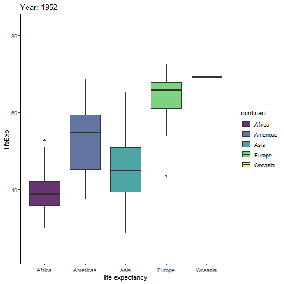

# **TL;DR**

This post introduces the [ggplot2](https://ggplot2.tidyverse.org/) package from the tidyverse and how the grammar of graphics helps you build customized plots in R. 

# **Introduction**

This post in the [Scientist's Guide to R series](https://craig.rbind.io/post/2019-05-17-asgr-basic-workflow/) introduces you to the grammar of graphics approach to data visualization in R with the popular [ggplot2](https://ggplot2.tidyverse.org/) package from the [tidyverse](https://www.tidyverse.org/) and some extension packages that expand its functionality. 

*Grammar:* rules about how words (elementary meaningful components of language) change their form and combine with other words to express meaning
- [Cambridge English dictionary](https://dictionary.cambridge.org/dictionary/english/grammar)

*Grammar of graphics:* rules about how elementary graphical components change visual representations of data and combine with other graphical components to express meaning.

To paraphrase `ggplot2` creator [Hadley Wickham](http://hadley.nz/), learning the grammar of graphics allows us to move beyond basic named plotting functions, like `elucidate::plot_box()` or `elucidate::plot_scatter()`, and leverage the layered structure of statistical graphics to produce bespoke visual presentations of data^[Wickham, H. (2011). ggplot2. Wiley Interdisciplinary Reviews: *Computational Statistics*, 3(2), 180-185.]. Data visualization is a core data analysis skill that is arguably the most powerful way of communicating research results. 

In [the previous post](https://craig.rbind.io/post/2020-12-07-asgr-3-0-exploring-data-with-elucidate/) on the `elucidate` package you learned about some convenience `plot_*` functions that were drawing graphs for you with `ggplot2`. In this post we dive into the mechanics of `ggplot2` so you can learn to build your own ggplots "from scratch".

The `ggplot2` grammar of graphics approach to plotting comes with some huge **advantages** over the alternatives: 

- Oodles of customization and control options are made accessible through a declarative and readable syntax. 
- Easier and more intuitive than plotting in base R or with the [lattice](https://cran.r-project.org/web/packages/lattice/lattice.pdf) package.
- Used by a massive and growing community of scientists and other data professionals so there are plenty of resources if you need help. 
- The new [plotnine](https://plotnine.readthedocs.io/) package in python and [gadfly](http://gadflyjl.org/) package in Julia (both inspired by ggplot2) mean that you're not just learning how to make graphs in R, but in Python and Julia as well.

**Disadvantages**:

- `ggplot2` is a comprehensive and flexible graphing system, which means there is *a lot* to learn, even without considering the many extension packages that have been developed in recent years. When customizing graphs I still have to look up the [documentation](https://ggplot2.tidyverse.org/reference/index.html) on `ggplot2` functions I don't use often. 

- `ggplot2` code can be a bit verbose with customized graphs taking up many lines, although if you find yourself copying and pasting code too often, you can use R's functional programming capabilities to condense/simplify things. This is why I built the `elucidate::plot_*` convenience functions. 

The declarative syntax of `ggplot2` is designed to allow you to describe visual features to use for constructing graphics while allowing R to handle the low level details for you (Wickham, 2011). This post will cover most of what you need to know to produce some of the most common plots used in psychology and related fields. Specifically, we will cover the following topics:

1. **`ggplot2` basics**: layers, aesthetic mappings, and geometries.

2. **Aesthetic customization**: labels, scales, colours, themes, fonts, etc.

3. **Faceting**: splitting a large/complex graph into panels.

4. **Layouts**: the `patchwork` extension package for arranging plot combinations.

5. **Animation** with the `gganimate` package.

6. **Exporting ggplots**: to a file on disk with `ggsave()`.

In this post we'll look at the `penguins` dataset from the `palmerpenguins` package. 

According to the description in the documentation (`?palmerpenguins::penguins`), these data are of body size measurements for different species of penguins in the Palmer archipelago collected annually from 2007-2009. 

By the end of this post, you should know enough to make snazzy graphs like this without much difficulty:

```{r echo=FALSE, message=FALSE, warning=FALSE, out.width = "100%"}
library(tidyverse)

data(penguins, package = "palmerpenguins")

penguins %>%
  ggplot(aes(y = flipper_length_mm, x = body_mass_g, fill = species)) +
  geom_jitter(size = 4, alpha = 0.5, shape = 21, colour = "black") +
  labs(x = "body mass (g)", y = "flipper length (mm)", 
       caption = "source: palmerpenguins R package") +
  ggthemes::theme_tufte(14) +
  ggsci::scale_color_lancet() +
  ggsci::scale_fill_lancet() +
  scale_x_continuous(limits = c(2500, 6500), breaks = seq(2500, 6500, 500)) +
  labs(title = "Flipper length as a function of body mass for <span style = 'color:#00468BFF;'>***P. adeliae*** **(Adelie)**</span>,<br><span style = 'color:#ED0000FF;'>***P. antarcticus*** **(Chinstrap)**</span>, and <span style = 'color:#42B540FF;'>***P. papua*** **(Gentoo)**</span> penguins<br>in the Palmer Archipelago") +
  guides(fill = FALSE, colour = FALSE) +
  theme(plot.title = ggtext::element_textbox())

```

# **Setup**

Because it is a core tidyverse package, `ggplot2` is installed for you when you install the `tidyverse` meta-package. However, if you're just joining the blog series now, you can install `ggplot2` using `install.packages()`:

```{r, eval = FALSE}
install.packages("ggplot2") #only run this if you haven't installed ggplot2 before (or updated it in a while)
install.packages("palmerpenguins") #contains the data we need
```

or 

```{r, eval = FALSE}
install.packages("tidyverse") #if you want to install/update the other core tidyverse packages too
install.packages("palmerpenguins")
```

I also recommend installing a few add on packages that enhance/supplement `ggplot2`'s capabilities (to be demonstrated in examples)

```{r, eval = FALSE}
install.packages(c("viridis", "RColorBrewer", "ggsci", #colour palettes
                   "ggthemes", #additional themes
                   "extrafont", #additional font family options
                   "ggrepel", #to avoid overlapping labels
                   "patchwork", #multi-plot arrangements/combinations
                   "plotly", #interactive plots
                   "gganimate" #animated ggplots
                   )) 

remotes::install_github("thomasp85/transformr") #enables gganimate to transition between different polygons

```


Then just load these like any other R package, with the `library()` function:

```{r setup, include=FALSE, eval=TRUE}
knitr::opts_chunk$set(cache = TRUE)
```

```{r}
library(tidyverse) #I'm loading ggplot2 with the rest of the core tidyverse packages
#or library(ggplot2) to just load ggplot2
```

I'm also going to load `elucidate` for [data interrogation](https://craig.rbind.io/post/2020-12-07-asgr-3-0-exploring-data-with-elucidate/#interrogating-data) and import the `penguins` data from the `palmerpenguins` package with the `data()` function. The remaining packages introduced in this post will be loaded later on when they are needed.

```{r, message = FALSE}
library(elucidate) #for data exploration/interrogation functions

#load data from an R package with the data function & package argument (could also import it by loading the package)
data(penguins, package = "palmerpenguins")
```

Next, we take our usual step of checking the structure of the data with the `dplyr::glimpse()` function (also loaded with the `tidyverse`).

```{r}
glimpse(penguins)
```

`glimpse()` tells us that there are 344 rows and 8 columns in the `penguins` data, two of which are numeric/double vectors (bill_length_mm and bill_depth_mm), three are integer vectors (flipper_length_mm, body_mass_g, and year), and three are factors (species, island, and sex). 

Next, we use `elucidate::dupes()`, `elucidate::counts_tb_all()`, and `elucidate::describe_all()` to check for duplicates, suspicious values, and missingness.  

```{r}
dupes(penguins)

describe_all(penguins, output = "dt")

counts_tb_all(penguins, n = 2)
```

These checks don't reveal any obvious issues aside from a few missing values. Approaches to dealing with missing values will be covered in detail in the next post, so for now we'll just drop the rows with missing values via `na.omit()` to keep things simple. 

```{r}
nrow(penguins)

penguins2 <- na.omit(penguins)

nrow(penguins2)
```

# **ggplot2 basics**

The first thing you need to know about the mechanics of `ggplot2` is that it builds plots in layers. This feature means that you can modify and add components to a graph by simply adding a layer to it, which makes it incredibly flexible. Unfortunately this flexibility can also be confusing for new users especially if they've only ever seen code for highly complex graphs that contain many layers. In my personal R learning journey, I found `ggplot2` to be a lot more intuitive when I realized that there are **only 3 layers** you need to build a basic graph:

  1. The **initialization layer**, which is just using the `ggplot()` function to tell R that you want to initialize a ggplot graphical object. I find it helpful to think of this as creating the blank canvas upon which the graph will be drawn.

  2. The **aesthetic layer**, added via the `aes()` function, is used to define aesthetic mappings, i.e. the assignment of variables in the data frame specified in the "data" argument of the initialization layer to visual features of the plot. 
  
  * In general, if you want a graphical feature of a ggplot to be based on the levels of a variable, you map the unquoted name of the variable to the feature inside the `aes()` function. For example, in the Palmer penguins data we could assign a different colour to the graphed values for each penguin species with `aes(colour = species)`, independently of the plot geometry (scatter plot, bar graph, box plot, etc.). In contrast, if you want to set a graphical parameter to a specific value that will be applied to all geometric objects of the same class that are drawn on the graph, like making all points on a scatter plot blue, you would  use `colour = "blue"` without the `aes()` part in a `geom_point()` layer (i.e. `geom_point(colour = "blue")`). This tells R that you want to set the colour of all geometric objects from the same layer (e.g. points on a scatter plot) to a specific colour, rather than assigning distinct colours to each level of a variable. Aesthetic mappings are the most conceptually challenging part of learning `ggplot2`, but their meaning will become clear after seeing some examples.
  
  3. A **geometry layer** to define the spatial features of the graph. There are many geometries available in `ggplot2` as intuitively named functions beginning with `geom_*`. Some of more commonly used ones are: 
  
  * `geom_histogram()` = histograms
  
  * `geom_density()` = kernel density plots
  
  * `geom_bar()` = bar charts 
  
  * `geom_point()` = scatter plots
  
  * `geom_box()` = box-and-whisker plots
  
  * `geom_violin()` = violin plots
  
  * `geom_line()` = line graphs
  
  * `geom_error()` = error bars
  
  * `geom_smooth()` = adds lines for conditional mean estimates (i.e. regression lines)
  
  You can visit the `ggplot2` reference page [here](https://ggplot2.tidyverse.org/reference/) for a full list. It is worth mentioning that the `ggplot2` layering system allows you to overlay multiple geometric layers on the same plot (just add another layer), a feature that was not obvious to me when I was starting to learn it.

You also need to know that layers are added to a ggplot using the `+` symbol instead of the pipe operator (`%>%`), where:

```{r, message=FALSE}
ggplot(data = penguins2) + #or equivalently penguins2 %>% ggplot() +
  aes(x = body_mass_g) +
  geom_histogram()

```

...can be read as: "initialize a ggplot while setting the data frame `penguins2` as the default dataset to use for aesthetic mappings, then add a layer of aesthetic mappings where the variable 'body_mass_g' is to be assigned to the x-axis of the graph, then add a geometry layer that tells R to draw a histogram of that variable."

***N.B.*** The [magrittr](https://magrittr.tidyverse.org/reference/pipe.html) package's pipe^[The latest version of R (4.1.0) also introduced a native pipe operator, `|>`, that behaves similarly to `%>%` except that it only allows you to pass the output of the left side to the first argument of the right side, whereas `%>%` lets you use a "." to insert the output of the previous operation anywhere in the subsequently applied function.] operator (`%>%`) was covered in [an earlier post](https://craig.rbind.io/post/2019-12-30-asgr-2-1-data-transformation-part-1/#chaining-functions-with-the-pipe-operator).

It is more common to see the `aes()` layer embedded in the initialization layer via `ggplot()`'s "mapping" argument, like this:

```{r, message = FALSE}
penguins2 %>% 
  ggplot(mapping = aes(x = body_mass_g)) + #or ggplot(penguins2, aes(x = body_mass_g))
  geom_histogram()
```
 
As you can clearly see, these are effectively identical in that they both define global aesthetic mappings that are "inherited" by all subsequent layers (`geom_histogram()` in this example) unless the "inherit.aes" argument in those layers is set to `FALSE`, e.g.

```{r, error=TRUE, fig.show='hide'}
ggplot(penguins2) + 
  aes(x = body_mass_g) +
  geom_histogram(inherit.aes = FALSE)
```
This time I get an error that `stat_bin()`, which is a function called by `geom_histogram()`, "requires an x or y aesthetic" (variable mapping), because I've told `geom_histogram()` to ignore the global/default mappings for the ggplot by setting "inherit.aes". In practice you probably won't use "inherit.aes" much because you can also just overwrite a mapping for a specific layer by using that layer's "mapping" argument like this:

```{r}
penguins2 %>% 
  ggplot(aes(x = body_mass_g)) + 
  geom_histogram(mapping = aes(x = flipper_length_mm))
```

Now we end up with a histogram that plots the *binned* distribution of the flipper_length_mm variable (as per the new x-axis mapping in the `geom_histogram()` layer) but the x-axis title still reads "body_mass_g" because the rest of the plotting components (of which axis titles are one) are affected by the default/global x-axis mapping we set to the body_mass_g variable in the `ggplot()` layer. 

  - The key point here is when you map a variable, like penguin body mass in grams, to an aesthetic parameter of a ggplot with the `aes()` function, in either the `ggplot()` initialization layer of the graph, like this:
  
```{r, eval = FALSE}
penguins2 %>% 
  ggplot(aes(x = body_mass_g))
```
  
  ...or as a separate layer, like this:
  
```{r, eval = FALSE}
penguins2 %>% 
  ggplot() +
  aes(x = body_mass_g)
```
  
  ...then that mapping of body mass to the x-axis will be applied by default to all layers of the plot. So you can add a second geom to the plot, like rug lines to density plot of body mass for each species...
  
```{r}
penguins2 %>% 
  ggplot() +
  aes(x = body_mass_g) +
  geom_density() +
  geom_rug()
```
...and each `geom_*` layer uses penguin body mass as the x-axis variable. If you only want to assign a variable aesthetic mapping to affect a single geom, then pass the `aes()` portion to the chosen `geom_*` layer's "mapping" argument instead, as in:

```{r}
penguins2 %>% 
  ggplot() +
  geom_density(aes(x = body_mass_g)) +
  geom_rug()
```
This time the rug lines aren't rendered because I've only assigned penguin body mass to the x-axis of the `geom_density()` layer and `geom_rug()` has no idea what is supposed to go on the x-axis.

# **aesthetic customization**

This section introduces fundamental methods of customizing ggplot aesthetic parameters, many of which can be either mapped to a variable within the `aes()` function, or applied globally outside of the `aes()` function. 

## titles/labels

To correct the title in the previous density plot we could use an `xlab()` layer (short for "x-axis label"), but I prefer the `labs()` function instead because you can use it to modify multiple labels/titles in the same layer, e.g. both the x and y axis labels:

```{r, message = FALSE}
penguins2 %>% 
  ggplot(aes(x = body_mass_g)) + 
  geom_histogram() +
  labs(x = "body mass (g)", y = "count (using 30 bins)")

```

Other labels that can be modified with `labs()` layer include:

  * **"title"**: the title of the ggplot, which appears at the top and is left-aligned by default.
  
  * **"subtitle"**: a subtitle for the ggplot that is in a slightly smaller font size and positioned just below the title (if there is one)
  
  * **"caption"**: a caption for the ggplot, which appears at the bottom and is right-aligned by default.
  
  * **"tag"**: adds a tag to the plot. Think about this as putting a letter "a" (or whatever text you want) in the top left corner of the graph (by default) to *tag* it as part **a** of multi-plot figure.
  
  * **"colour"/"color"**: if a variable has been assigned to "colour" ("color" is also valid if you prefer); this controls the title of colour legend.
  
  * **"fill"**: if a variable has been  assigned to "fill", this controls the title of fill legend.
  
  * **"size"**: if a variable has been assigned to "size", this controls the title of size legend.
  
  * **"shape"**: if a variable has been assigned to "shape", this controls the title of shape legend.
  
  * **"linetype"**: if a variable has been assigned to "linetype", this controls the title of the linetype legend. 

***N.B.*** you can remove any of these labels by setting them to `NULL` in a `labs()` layer, e.g.:


```{r, message = FALSE}
penguins2 %>% 
  ggplot(aes(x = body_mass_g)) + 
  geom_histogram() +
  labs(x = "body mass (g)", y = NULL,
       caption = "source: palmerpenguins R package")

```

## fill

The fill aesthetic in `ggplot2` controls the fill colour of ggplot geometric components. You can either map a variable to fill using the `aes()` function,

```{r, message = FALSE}
penguins2 %>% 
  ggplot(aes(x = body_mass_g)) +
  geom_histogram(aes(fill = species)) +
  labs(fill = "Species")
```
...or you can set it to a single value (as a character string) to be applied globally by specifying it in the geometry layer *outside* of `aes()`.

```{r, message = FALSE}
penguins2 %>% 
  ggplot(aes(x = body_mass_g)) +
  geom_histogram(fill = "blue2")
```
As you can see, when you assign a variable to the fill (colour) aesthetic, you get different fill colours for each value/level of the specified variable, which is a convenient way of splitting the data in a ggplot. You'll also get a legend by default. Other aesthetics covered below behave similarly (colour, shape, size, etc.). 


Recall from the last [post](https://craig.rbind.io/post/2020-12-07-asgr-3-0-exploring-data-with-elucidate/) that we can see the colour options available in base R via `elucidate::colour_options()`...

```{r}
elucidate::colour_options()
```
...which will be easy to read if you run it yourself and expand it to full screen viewing mode.


`ggplot2` also provides `scale_*` functions that give you finer control over many aesthetic features of the graphs you build. For example, we can add a `scale_fill_manual()` layer to change the fill colours assigned to groups in a histogram...

```{r, message = FALSE}
penguins2 %>% 
  ggplot(aes(x = body_mass_g)) +
  geom_histogram(aes(fill = species)) +
  scale_fill_manual(values = c("royalblue3", "darkorchid2", "green3"))

```

...or `scale_fill_continuous()`/`scale_fill_gradient()` if a continuous variable has been assigned to the fill aesthetic in a scatter plot.

```{r, message = FALSE}
penguins2 %>% 
  ggplot(aes(x = bill_length_mm, y = bill_depth_mm, fill = body_mass_g)) +
  geom_point(shape = 21, size = 4) +
  scale_fill_continuous(low = "blue", high = "red")
```

## colour/color

The colour aesthetic in `ggplot2` controls the outline colour of ggplot geometric components. Note that both the British/Canadian (colour) and American (color) English spellings are valid thanks to the `ggplot2` authors. Like fill, you can either map a variable to outline colour using the `aes()` function, 


```{r, message = FALSE}
penguins2 %>% 
  ggplot(aes(x = body_mass_g)) +
  geom_histogram(aes(colour = species))
```

...or you can set it to a single value (outside of `aes()`).

```{r, message = FALSE}
penguins2 %>% 
  ggplot(aes(x = body_mass_g)) +
  geom_histogram(colour = "blue2",
                 fill = "white")
```

For finer control, you can use `scale_colour_manual()`... 

```{r, message = FALSE}
penguins2 %>% 
  ggplot(aes(y = body_mass_g, x = species, colour = species)) +
  geom_boxplot() +
  scale_colour_manual(values = c("green3", "blue3", "red2"))
```
...or `scale_colour_continuous()`, just like the `scale_fill_*` functions. If you want to specify more than 2 colours to use in constructing a colour gradient, then try the `scale_colour_gradientn()` function instead^[There *is* an equivalent `scale_fill_gradientn()` function in case you were wondering.].

```{r}
penguins2 %>% 
  ggplot(aes(x = bill_length_mm, y = bill_depth_mm, colour = body_mass_g)) +
  geom_point(shape = "square", size = 4) +
  scale_colour_gradientn(colours = c("blue", "yellow", "red")) #in order from low to medium to high
```


## reorering factors

To move the box plot for Gentoo penguins to the far left in the second last graph, we can use `forcats::fct_relevel()` in a call to [dplyr::mutate()](https://craig.rbind.io/post/2019-12-30-asgr-2-1-data-transformation-part-1/#mutate) *before* passing the data to the `ggplot()` function.

```{r}
penguins2 %>% 
  mutate(species = fct_relevel(species, "Gentoo")) %>% 
  ggplot(aes(y = body_mass_g, x = species, colour = species)) +
  geom_boxplot() +
  #the order of colours should match the order of factor levels
  scale_colour_manual(values = c("green3", "blue3", "red2")) 
```
See the earlier [post](https://craig.rbind.io/post/2020-08-29-asgr-2-4-factors/) on factors and the [forcats](https://forcats.tidyverse.org/) package for more information on manipulating factor levels in R.

## colour palettes

If you don't want to pick individual colours to use yourself, you should be aware that there are several packages that provide conveniently organized colour palettes. See this [link](https://github.com/EmilHvitfeldt/r-color-palettes/blob/master/type-sorted-palettes.md) for the most comprehesive list I've come across so far. For the purposes of this blog post I will only cover four of these packages: the [RColorBrewer](https://cran.r-project.org/web/packages/RColorBrewer/index.html), [ggsci](https://nanx.me/ggsci/articles/ggsci.html), [colorblindr](https://github.com/clauswilke/colorblindr), and [viridis](https://cran.r-project.org/web/packages/viridis/vignettes/intro-to-viridis.html) packages. 

[RColorBrewer](https://cran.r-project.org/web/packages/RColorBrewer/index.html), which is installed automatically for you with `ggplot2`, was perhaps the first package to offer convenient color palettes for data visualization in R, and provides three types of palettes: sequential, diverging, and qualitative. According to [the package documentation](https://cran.r-project.org/web/packages/RColorBrewer/RColorBrewer.pdf):

  1. **Sequential** palettes are appropriate for ordered variables that progress from low to high values, where low values are assigned light colours and high values are assigned dark colours. Sequential palettes are useful if you want to emphasize extreme values.
  
  2. **Diverging** palettes are useful when you want to place equal emphasis on low, middle, and high values of an ordered variable. 
  
  3. **Qualitative** palettes are useful for unordered categorical variables where the goal is to simply use distinct colours for each group. I tend to use these ones most often out of the RColorBrewer palettes. 

You can view the `RColorBrewer` palette options in your R session's active graphics device (e.g. R studio "plot" tab) with `RColorBrewer::display.brewer.all()`. Here I'll show you the different palette types separately so they all appear on the screen legibly, but you will be able to see them all at once if you run the default `display.brewer.all()` command yourself.

```{r}
#sequential
RColorBrewer::display.brewer.all(type = "seq")

#diverging
RColorBrewer::display.brewer.all(type = "div")

#qualitative
RColorBrewer::display.brewer.all(type = "qual")
```

`ggplot2` provides `scale_fill_brewer()` and `scale_colour_brewer()` (or `scale_color_brewer()` if you prefer) as convenience functions that allow you to access these palettes via the "palette" argument. E.g.

```{r, message = FALSE}
penguins2 %>% 
  ggplot(aes(x = body_mass_g)) +
  geom_histogram(aes(fill = species)) +
  scale_fill_brewer(palette = "Dark2")
```

Alternatively, you can use the `RColorBrewer::brewer.pal()` function with the "n" and "name" arguments to generate a character vector of colour names of length n that can be passed to any plotting function in R.

```{r, message = FALSE}
RColorBrewer::brewer.pal(n = 3, name = "Set1")

penguins2 %>% 
  ggplot(aes(x = body_mass_g)) +
  geom_histogram(aes(fill = species)) +
  scale_fill_manual(values = RColorBrewer::brewer.pal(n = 3, name = "Set1"))
```

Those of us who are interested in publishing our work in peer-reviewed journals may be interested in using the [ggsci](https://nanx.me/ggsci/articles/ggsci.html) package, which provides palettes inspired by common colour schemes used by prominent journals, like *Nature*, *Science*, *JAMA*, and *The New England Journal of Medicine* (and several others inspired by science fiction). When `ggsci` is loaded, you can access these palettes with additional `scale_fill_*` and `scale_colour/color_*` functions, where * can be any of the `ggsci` palette names. See the package [website](https://nanx.me/ggsci/articles/ggsci.html) for a full list. For the sake of brevity, I will just demonstrate the *Nature*-themed palette because, like most other scientists, I've always dreamed of one day publishing in *Nature*.

```{r}
library(ggsci)

penguins2 %>% 
  ggplot(aes(y = body_mass_g)) +
  geom_boxplot(aes(fill = species)) +
  scale_fill_npg() #npg = Nature Publishing Group
  
```

As soon as you have some data worthy of publication in *Nature* (good luck!) you'll now have no trouble making figures for it! 

## colourblind-friendly palettes

To assess the friendliness of your graphs to colour blind individuals, you should check out the website for the  [colorblindr](https://github.com/clauswilke/colorblindr) package by `ggplot2`' developer and author of [The Fundamentals of Data Visualization](https://clauswilke.com/dataviz/), Claus Wilke. You can even upload an image file of a finished graph and simulate how it will look like to colour blind individuals with this cool [simulation tool](http://hclwizard.org:3000/cvdemulator/). 

The [viridis](https://sjmgarnier.github.io/viridis/) package's colour palettes are all colourblind-friendly, examples of which are shown [here](https://cran.r-project.org/web/packages/viridis/vignettes/intro-to-viridis.html#the-color-scales). 

`viridis` doesn't come with a built-in convenience function to display all of the colour palettes at once, but we can show them each using `scales::show_col()` and `viridis::viridis_pal()`. Five options can be displayed this way: 

```{r, message=FALSE}
#both of these packages are installed for you with ggplot2 so we can just load them
library(scales)
library(viridis)

show_col(viridis_pal(option = "magma")(9)) #equivalent to option = "A".

show_col(viridis_pal(option = "inferno")(9)) #equivalent to option = "B".

show_col(viridis_pal(option = "plasma")(9)) #equivalent to option = "C".

show_col(viridis_pal(option = "viridis")(9)) #the default, equivalent to option = "D".

show_col(viridis_pal(option = "cividis")(9)) #equivalent to option = "E".

```

We can use one of these palettes in a ggplot with `viridis::scale_fill_viridis()` or `viridis::scale_colour_viridis()` (or `viridis::scale_color_viridis()`)

```{r, message=FALSE}
penguins2 %>% 
  ggplot(aes(x = body_mass_g)) +
  geom_density(aes(fill = species)) +
  scale_fill_viridis(option = "viridis", #the default
                     discrete = TRUE) 
                     #discrete = TRUE needs to be added here to use
                     #scale_*_viridis() for a discrete variable
```

## size

The obviously named "size" aesthetic parameter adjusts the size of a geom. Like other `ggplot2` aesthetics, you would either assign a numeric variable to size in `aes()`... 


```{r}
penguins2 %>% 
  ggplot(aes(x = bill_length_mm, y = bill_depth_mm, 
             size = body_mass_g)) + #point size will be proportional to body_mass_g
  geom_point(colour = "blue2") #scatter plot
```

...or set the geom size to a specific value.


```{r}
penguins2 %>% 
  ggplot(aes(x = bill_length_mm, y = bill_depth_mm)) + 
  geom_point(colour = "blue2", size = 4) 
```

As you can see, setting an additional continuous variable to the size aesthetic of a scatter plot is an easy way to explore relationships between 3 variables at once (also called a ["bubble chart"](https://www.data-to-viz.com/graph/bubble.html)). I also find it easier to read than extending the plot into a third spatial dimension, which we can do with [plotly](https://plotly.com/r/3d-scatter-plots/) instead of `ggplot2`:

```{r, message = FALSE, warning = FALSE}
penguins2 %>% 
  plotly::plot_ly(x = ~bill_length_mm, 
                  y = ~bill_depth_mm, 
                  z = ~body_mass_g,
                  type = "scatter3d", 
                  color = I("blue2"))

#hint: try hovering your mouse over this plot and clicking/dragging it in
#different directions to rotate it.
```

***N.B.*** I recommend against using 3D scatter plots like this for anything other than data exploration on your own or if you are planning to personally demonstrate the relationships between the three variables by rotating the graph for an audience. 

## shape

As you may have guessed, the "shape" parameter affects the shape of the chosen geom, which is typically the points of a scatter plot. You can either map a categorical variable to it...

```{r}
penguins2 %>% 
  ggplot(aes(x = bill_length_mm, y = bill_depth_mm, 
             shape = island)) + 
  geom_point(size = 3) #scatter plot
```

...or set it to a specific shape choice (see [here](https://ggplot2.tidyverse.org/articles/ggplot2-specs.html?q=shape#sec:shape-spec) for options).

```{r}
penguins2 %>% 
  ggplot(aes(x = bill_length_mm, y = bill_depth_mm)) + 
  geom_point(size = 3, shape = 21)
```

## linetype

Changes the type of line (solid, dashed, dotted, etc.) in a line graph. Set globally in the `geom_line()` layer...

```{r}
penguins2 %>%
  mutate(year = factor(year, ordered = TRUE)) %>% 
  group_by(year) %>% 
  summarise(avg_body_mass_g = mean(body_mass_g), .groups = "drop") %>% #to get a single value per year
  ungroup() %>% 
  ggplot(aes(x = year, y = avg_body_mass_g)) + 
  geom_line(aes(group = 1), linetype = "dashed", size = 1.5)
#set the group aesthetic to 1 to disable grouping of lines

```


...or map a categorical variable to it with `aes()`:

```{r}
penguins2 %>%
  mutate(year = factor(year, ordered = TRUE)) %>%
  group_by(year, species) %>%
  summarise(avg_body_mass_g = mean(body_mass_g), .groups = "drop") %>% #to get a single value per year
  ungroup() %>%
  ggplot(aes(x = year, y = avg_body_mass_g)) + 
  geom_line(aes(group = species, linetype = species), size = 1.5)
  #In aes() for geom_line(), "group" splits the lines and "linetype" assigns a
  #different line type to each group

```


## alpha (transparency/opacity)

The "alpha" aesthetic adjusts the transparency of a geom and can be specified using a value ranging between 0 (0% opaque/100% transparent) and 1 (100% opaque/0% transparent). It is especially helpful in cases where "overplotting" obscures some of the data because there are too many overlapping elements, like the scatter plot I made of penguin bill depth by bill length...

```{r}
penguins2 %>% 
  ggplot(aes(x = bill_length_mm, y = bill_depth_mm)) + 
  geom_point(colour = "blue2", size = 4, alpha = 0.5) 
```

...or density plots of penguin body masses grouped by species.

```{r}
penguins2 %>% 
  ggplot(aes(x = body_mass_g, fill = species, group = species)) +
  geom_density(alpha = 0.6)
```

## jittering to reduce overplotting

In addition to modifying the transparency of a geom to deal with overplotting, we can also slightly move geometric objects in random directions, or "jitter" them by adding random noise. This should retain most statistical properties of the data (because the displacements are random), while making it easier to see more of the data. Jittering can be used with any `ggplot2` geom that accepts the output of the `ggplot2::position_jitter()` function as an option for a "position" argument. This is so common in scatter plots that there is even a shortcut function, `ggplot2::geom_jitter()`, that you can use instead of `ggplot2::geom_point(position = position_jitter())`.


```{r}
penguins2 %>% 
  ggplot(aes(x = bill_length_mm, y = bill_depth_mm)) +  
  geom_jitter(colour = "blue2", size = 3, alpha = 0.5) 
  #or, equivalently: 
  # geom_point(colour = "blue2", size = 3, alpha = 0.5, 
  #            position = position_jitter())
```
One exception to this advice is the situation when the geom you want to jitter happens to be text, e.g. labels for the species of a penguin that were rendered via `ggplot2::geom_text(aes(label = species))`, like this:

```{r}
set.seed(2021) #set random number generator seed for reproducibility

#I'll just sample 50 rows at random (i.e. data for 50 penguins) for demo
#purposes
penguins_sample <- penguins2[sample(seq_len(nrow(penguins2)), 50), ] 

penguins_sample %>% 
  ggplot(aes(x = bill_length_mm, y = bill_depth_mm)) +  
  geom_jitter(colour = "blue", size = 3, alpha = 0.5) +
  geom_text(aes(label = species)) 
```

The best option for moving the labels out of the way of the points and other labels is to use the `ggplot2` extension package [ggrepel](https://ggrepel.slowkow.com/), which contains a `geom_text_repel()` function to repel labels from one another in ggplots. It also conveniently works with `geom_jitter()`, as shown here:

```{r}
penguins_sample %>% 
  ggplot(aes(x = bill_length_mm, y = bill_depth_mm)) +  
  geom_jitter(colour = "blue", size = 3, alpha = 0.5) +
  ggrepel::geom_text_repel(aes(label = species))

```

That's so much easier to read!

## coordinates

### coord_flip()

You can add a `coord_flip()` layer to your ggplot graph if you want to swap the x and y axes. This can be particularly helpful if you have overlapping tick labels on the x axis, like a long list of countries, as in the [gapminder](https://www.rdocumentation.org/packages/gapminder/versions/0.3.0) data that we've seen many times [before](https://craig.rbind.io/post/2020-01-25-asgr-2-1-data-transformation-part-2/) in the blog series...

```{r}
set.seed(2021) #set the random number generator seed for reproducibility

gapminder::gapminder %>% 
  filter(country %in% sample(unique(gapminder::gapminder$country), 20)) %>% #we'll try to plot 20 for now 
  ggplot(aes(x = country, y = gdpPercap)) +
  geom_violin(fill = "limegreen")
```

vs. 


```{r}
gapminder::gapminder %>% 
  filter(country %in% sample(unique(gapminder::gapminder$country), 20)) %>% 
  ggplot(aes(x = country, y = gdpPercap)) +
  geom_violin(fill = "limegreen") +
  coord_flip()
```


### coord_cartesian()

`coord_cartesian()` allows you to zoom in on a portion of the data without dropping any values. Simply set the x-axis or y-axis (viewing) limits with "xlim" or "ylim" as appropriate. This could allow us to zoom into the lower end of the GDP per capita scale in the above violin plots, e.g. 

```{r}
gapminder::gapminder %>% 
  filter(country %in% sample(unique(gapminder::gapminder$country), 20)) %>% 
  ggplot(aes(x = country, y = gdpPercap)) +
  geom_violin(fill = "limegreen") +
  coord_cartesian(ylim = c(0, 2500)) 

```

Unfortunately, we can't combine `coord_flip()` and `coord_catesian()` layers in the same ggplot because the last one added will overwrite the first, as per the message that prints to the console when I try it:


```{r}
gapminder::gapminder %>% 
  filter(country %in% sample(unique(gapminder::gapminder$country), 20)) %>% 
  ggplot(aes(x = country, y = gdpPercap)) +
  geom_violin(fill = "limegreen") +
  coord_cartesian(ylim = c(0, 2500)) +
  coord_flip()

```

To get around this issue, `coord_flip()` also accepts "xlim" and "ylim" specifications for zooming in on a subset of the data just like `coord_cartesian()` does.

```{r}
gapminder::gapminder %>% 
  filter(country %in% sample(unique(gapminder::gapminder$country), 20)) %>% 
  ggplot(aes(x = country, y = gdpPercap)) +
  geom_violin(fill = "limegreen") +
  coord_flip(ylim = c(0, 2500)) 

```

***N.B.*** You should avoid setting x or y axis limits with the "limits" argument of `scale_x_continuous()` or `scale_y_continuous()` to restrict the range of values that are shown in your graphs; doing so will affect the statistical properties (and shape) of geoms like density curves and regression lines that are drawn based on calculations using data within the limits set by `scale_x_continuous()` and/or `scale_y_continous()`. Fortunately, you now know that you can use `coord_cartesian()` or `coord_flip()` for this purpose instead so it shouldn't be a problem for you.


## guides (legends)

I'm sure you've noticed that whenever we map a variable to an aesthetic parameter inside the `aes()` function, a guide (AKA legend) is automatically added to the plot for us. If you want to omit a guide, simply set it to `FALSE` for that aesthetic parameter, like this: 

```{r}
penguins2 %>% 
  ggplot(aes(x = species, y = body_mass_g, fill = species)) +
  geom_violin() +
  scale_fill_viridis(discrete = TRUE) +
  guides(fill = FALSE)
```

In this case, it makes sense to omit the guide for fill because it isn't needed. I suppose the fill colours aren't needed for this graph either, but you might want to use them for consistency with other plots where the guide was needed. 

## x & y axis modifications


### `scale_x_continuous()/scale_y_continuous()`

`scale_x_continuous()` controls the x-axis "breaks", "limits", and "labels" when x is a continuous variable. I find it helpful to use the base R `seq()` function when modifying the axis break points.

```{r}
penguins2 %>% 
  ggplot(aes(x = bill_length_mm, y = bill_depth_mm)) + 
  geom_point(colour = "blue2", size = 4, alpha = 0.5) +
  scale_x_continuous(limits = c(30, 60),
                     breaks = seq(from = 30, #start at 
                                   to = 60, #end at
                                   by = 5)) #by this increment


```

You can also modify the x-axis title/label here with the "names" argument and apply a transformation to the x-axis with with the "trans" argument.

```{r}
penguins2 %>% 
  ggplot(aes(x = bill_length_mm, y = bill_depth_mm)) + 
  geom_point(colour = "blue2", size = 4, alpha = 0.5) +
  scale_x_continuous(name = "bill length (mm)",
                     trans = "reverse",
                     #keep in mind the transformation when specifying axis limit
                     #and breaks
                     limits = c(60, 30),
                     breaks = seq(60, 30, -5))
  
```
See the "trans" argument description with `?scale_x_continuous()` for a full list of available transformations and information on custom transformation functions via the [scales](https://scales.r-lib.org/) package function `scales::trans_new()` 

I can't say that I've ever needed to do this before, but you can also move the axis to the opposite side of the graph with the "position" argument ("bottom" or "top" for x-axis, "left" or "right" for y-axis).

```{r}
penguins2 %>% 
  ggplot(aes(x = bill_length_mm, y = bill_depth_mm)) + 
  geom_point(colour = "blue2", size = 4, alpha = 0.5) +
  scale_y_continuous(position = "right")
```
If you want to add a second x/y-axis on the top/right side of a graph you can use the "sec.axis" argument to `scale_x_continuous()` and/or `scale_y_continuous()`:

```{r}
penguins2 %>% 
  ggplot(aes(x = bill_length_mm, y = bill_depth_mm)) + 
  geom_point(colour = "blue2", size = 4, alpha = 0.5) +
  scale_x_continuous(name = "bill length (mm)",
                     sec.axis = sec_axis(~ . /10, name = "bill length (cm)")) +
  scale_y_continuous(name = "bill depth (mm)",
                     sec.axis = sec_axis(~ . /10, name = "bill depth (cm)"))
  
#where "." in this case represents the value of the original y axis
```

Overlaying 2 different geoms with very different y-axis scales is difficult to do in `ggplot2` because the lead author, Hadley Wickham, [asserts](https://stackoverflow.com/a/3101876) that it is generally bad practice and "fundamentally flawed".

One non-flawed example of when it would be OK to do this, in my opinion, is overlaying a normal distribution kernel density plot over a histogram, like this:

```{r}
bw <- 100 #define bin width to be used in the histogram
n_obs <- sum(!is.na(penguins2$body_mass_g)) #count of non-missing observations

#define a function that returns the normal density curve scaled by the bin width
#and number of observations
scaled_dnorm <- function(x) {
    dnorm(x, mean = mean(penguins2$body_mass_g), sd = sd(penguins2$body_mass_g)) * (bw * n_obs)
}

penguins2 %>% 
  ggplot(aes(x = body_mass_g)) +
  geom_histogram(binwidth = bw) +
  #pass the custom scaled_dnorm function to the fun argument of a
  #stat_function() layer
  stat_function(fun = scaled_dnorm, colour = "blue2", size = 1.5, alpha = 0.8) + 
  #then reverse the scaling in the sec.axis = sec_axis() part of
  #scale_y_continuous so the secondary y-axis shows the density values
  scale_y_continuous(sec.axis = sec_axis(trans = ~./(bw*n_obs), name = "density", labels = scales::scientific)) +
  #optionally, make the secondary y-axis the same colour as the density curve
  #using theme()
  theme(axis.ticks.y.right = element_line(colour = "blue2"),
        axis.text.y.right = element_text(colour = "blue2"), 
        axis.title.y.right = element_text(colour = "blue2")) 
```

### `scale_x_discrete()/scale_y_discrete()`

If a categorical variable has been assigned to the x-axis, as in this box-and-whiskers plot, 

```{r}
penguins2 %>% 
  ggplot(aes(x = species, y = body_mass_g)) +
  geom_boxplot()
```

you can modify the axis title, labels, factor levels that are displayed, and position with `scale_x_discrete()`.

```{r}
penguins2 %>% 
  ggplot(aes(x = species, y = body_mass_g)) +
  geom_boxplot() +
  scale_x_discrete(name = "Species", 
                   position = "top", 
                   limits = c("Chinstrap", "Gentoo"),
                   labels = c("C", "G"))
```

`scale_y_continuous()` and `scale_y_discrete()` are the equivalent functions for the y-axis.

## axis label scales 

The [scales](https://scales.r-lib.org/) package, a `ggplot2` dependency^[meaning it is installed for you when you installed `ggplot2`], makes it incredibly easy to reformat x and y axis labels (among other things).  For example, if you wanted to insert commas in every three digits of the labels for a continuous variable, you could use `scales::label_comma()` by passing it to the "labels" argument of `scale_x_continuous()`, like this:

```{r}
penguins2 %>% 
  ggplot(aes(x = body_mass_g, y = flipper_length_mm)) +
  geom_point() +
  scale_x_continuous(labels = scales::label_comma())
```
or convert very large/small values, e.g. populations of countries in the [gapminder](https://www.rdocumentation.org/packages/gapminder/versions/0.3.0) data, to scientific notation on the x axis of a scatter plot with `scales::label_scientific()` 

```{r}
gapminder::gapminder %>% #using data frame gapminder from the gapminder package
  ggplot(aes(x = pop, y = gdpPercap)) +
  geom_point(colour = "blue2", size = 2, alpha = 0.5) +
  scale_x_continuous(labels = scales::label_scientific())
```

or add dollar symbols to the GDP per capita values on the y-axis with `scales::label_dollar()`. It's definitely worth spending a few minutes to peruse the [reference page](https://scales.r-lib.org/reference/index.html) and take stock of the many options. 

While we're here, I'll incorporate some other features in the `scale_x_continuous()` layer by applying a base 10 logarithmic transformation to both axes to spread things out a bit from the bottom-left corner. Perhaps it would also be easier to read if we mapped another variable to the colour aesthetic, like life expectancy, using the "plasma" viridis colour palette.

```{r}
gapminder::gapminder %>% #using data frame gapminder from the gapminder package
  ggplot(aes(x = pop, y = gdpPercap, fill = lifeExp)) +
  geom_point(size = 3, alpha = 0.7, colour = "black", shape = 21) +
  scale_x_continuous(trans = "log10",
                     labels = scales::label_scientific()) +
  scale_y_continuous(trans = "log10",
                     labels = scales::label_dollar())  +
  scale_fill_viridis(option = "plasma", end = 0.9) 

```

Much better for only a few extra lines of code!


## themes

The `theme()` function in `ggplot2` gives you much finer control over graphical features unrelated to the data being plotted, like the background color of the `ggplot()` foundation layer, or the font typeface (i.e. bold, italic). There are far too many graphical feature modifications accessible to you through `theme()` to cover them in this post. I will therefore leave it as an exercise to the reader to simply consult the function's [reference page](https://ggplot2.tidyverse.org/reference/theme.html) as needed when building graphs.

Fortunately, you won't need to use the `theme()` function directly too often, as there are many `theme_*` shortcut functions that control all non-data elements of a ggplot which are available from `ggplot2` itself and expansion packages like [ggthemes](https://jrnold.github.io/ggthemes/index.html) that you can use instead.

The themes available in `ggplot2` itself are:

`theme_grey()`/`theme_gray()`; the `ggplot2` default

```{r}
penguins2 %>% 
  ggplot(aes(x = body_mass_g)) +
  geom_density(fill = "blue2", alpha = 0.5) +
  theme_grey(base_size = 14) #base_size = 14 changes the base font size to 14
```

Note that the `theme_*` layer is the key part of the code in these examples.


`theme_bw()`

```{r}
penguins2 %>% 
  ggplot(aes(x = body_mass_g)) +
  geom_density(fill = "blue2", alpha = 0.5) +
  theme_bw(14) #base_size is the first argument so you don't need to specify it
```

`theme_classic()`; the [elucidate](https://craig.rbind.io/post/2020-12-07-asgr-3-0-exploring-data-with-elucidate/) package default

```{r}
penguins2 %>% 
  ggplot(aes(x = body_mass_g)) +
  geom_density(fill = "blue2", alpha = 0.5) +
  theme_classic(14) 
```
  
`theme_dark()`

```{r}
penguins2 %>% 
  ggplot(aes(x = body_mass_g)) +
  geom_density(fill = "blue2", alpha = 0.5) +
  theme_dark(14) 
```

  
`theme_light()`
  
```{r}
penguins2 %>% 
  ggplot(aes(x = body_mass_g)) +
  geom_density(fill = "blue2", alpha = 0.5) +
  theme_light(14) 
```

`theme_linedraw()`
  
```{r}
penguins2 %>% 
  ggplot(aes(x = body_mass_g)) +
  geom_density(fill = "blue2", alpha = 0.5) +
  theme_linedraw(14) 
```


`theme_minimal()`
  
```{r}
penguins2 %>% 
  ggplot(aes(x = body_mass_g)) +
  geom_density(fill = "blue2", alpha = 0.5) +
  theme_minimal(14) 
```

...and `theme_void()`

```{r}
penguins2 %>% 
  ggplot(aes(x = body_mass_g)) +
  geom_density(fill = "blue2", alpha = 0.5) +
  theme_void(14)
```

The [ggthemes](https://jrnold.github.io/ggthemes/index.html) package offers a nice variety of additional themes like `theme_wsj()` combined with matching fill colour palette `scale_fill_wsj()`...


```{r}
penguins2 %>% 
  ggplot(aes(x = body_mass_g, fill = species)) +
  geom_density(alpha = 0.5) +
  ggthemes::theme_wsj(14) + #wsj = Wall Street Journal
  ggthemes::scale_fill_wsj()

```

...that you should try out on a rainy day.


One last thing to be aware of for now is that you can set a theme for all of the ggplots you make with the `ggplot2::theme_set()` function. Just wrap it around the `theme*`, like this:

```{r, eval = FALSE}
theme_set(theme_classic())
```

...to change the default `ggplot2` theme from `theme_grey()` to `theme_classic()` for the duration of your R session.


## text formatting with `ggtext`

The [ggtext](https://wilkelab.org/ggtext/articles/introduction.html) extension package for `ggplot2` makes it considerably easier to change the formatting of text in ggplot graphs via [Markdown](https://bookdown.org/yihui/rmarkdown/) and html rendering. `ggtext` provides a few new theme elements to simplify text formatting, such as `element_markdown()` & `element_textbox()` (or `element_textbox_simple()`). According to the linked webpage, the following text element customization features are currently supported:

  - bold and/or italics (`*text*` for *italics*, `**text**` for **bold**, and `***text***` for ***both***)
  - changing the font
  - colour
  - size
  - subscript or superscript placement of text (`<sub>text to be subscripted</sub>` or `<sup>text to be superscripted</sup>`)
  - "rudimentary" support for images
  
For example, to bold segments of the x and y axis titles we can use the `**text**` double asterisk Markdown syntax and then call `ggtext::element_markdown()` (in place of `ggplot2::element_text()`), in a `theme()` layer. We can also specify a line break in a title using `<br>`, and adjust the colour of a portion of a label between an html-defined "span", using:

`<span style = 'color:r_colour_name;'>text</span>` 

or 

`<span style = 'color:r_colour_hex_code;'>text</span>`

```{r}
penguins2 %>% 
  ggplot(aes(x = bill_length_mm, y = bill_depth_mm, fill = species)) +  
  geom_jitter(size = 4, alpha = 0.5, shape = 21) +
  scale_fill_manual(values = c("Red3", "blue3", "green3")) +
  #change the x and y axis titles with the **text** markdown syntax to bold part
  #of the text
  labs(x = "**bill length** (mm)", 
       y = "**bill depth** (mm)",
       #customize the color of parts of the plot title using the html 
       # <span>style = 'color:colorname;'>text to be coloured</span> syntax
       #Notice from this example that you can also use the markdown bold/italics
       #syntax on text between the <span> </span> segments
       title = "Scatterplot of bill lengths and bill depths of <span style = 'color:red3;'>***P. adeliae*** **(Adelie)**</span>, 
       <span style = 'color:blue3;'>***P. antarcticus*** **(Chinstrap)**</span>, 
       and <span style = 'color:green3;'>***P. papua*** **(Gentoo)**</span> penguins in the Palmer Archipelago") +
  theme_bw() +
  theme(plot.title = ggtext::element_textbox_simple(size = 12), #adjust the font size of the title
        #adjust the colour of the entire label in the theme layer like this
        axis.title.x = ggtext::element_markdown(colour = "darkorchid4", 
                                                size = 14), 
        #adjust the colour of the entire label in the theme layer like this
        axis.title.y = ggtext::element_markdown(colour = "darkorchid4", 
                                                size = 14)) + 
  #because we've identified the species fill colour in the plot title we no
  #longer need the fill legend
  guides(fill = FALSE)  
```

It's a bit beyond the scope of this post, but if you're interested in learning how to write your own `theme_*` function, I recommend checking out this other [blog post](https://themockup.blog/posts/2020-12-26-creating-and-using-custom-ggplot2-themes/#custom-themes) by [Thomas Mock](https://themockup.blog/about.html), the creator of [TidyTuesday](https://github.com/rfordatascience/tidytuesday/blob/master/README.md).


## fonts

If you want to change the font family of the text elements of a graph, you can use the "base_family" argument accepted by most `theme_*` layers. With just `ggplot2` installed, you'll only be able to access these three font options^[If you're using a PC with Windows, you can print these options to the console with `windowsFonts()`]:

  1. **"serif"** = Times New Roman
  
  2. **"sans"** = Arial, which is the `ggplot2` default.
  
  3. **"mono"** = Courier New

```{r}
penguins2 %>% 
  ggplot(aes(x = body_mass_g)) +
  geom_density(fill = "blue2", alpha = 0.5) +
  theme_bw(base_size = 16, #font size 
           base_family = "serif") #font family

```

[Winston Chang](https://www.rstudio.com/speakers/winston-chang/)'s [extrafont](https://github.com/wch/extrafont/blob/master/README.md) package makes it easy to access many more font family options. Simply run `extrafont::font_import()` once after installing the package on a computer to import the available True Type fonts from your operating system. It can take a few minutes for `extrafont::font_import()` to locate the font information located on your computer and copy it over to R so be patient.

```{r, message = FALSE, eval = FALSE}
extrafont::font_import() #run once per computer or after installing a new font
```

Afterwards, you should see a much longer list of font options if you use the `extrafont::fonts()` or `extrafont::fonttable()` function, like this:

```{r}
font_vector <- extrafont::fonts()

#I'll just print a random sample of 20 font options as examples here
sample(font_vector, 20)

```

After importing fonts from your OS with `extrafont::font_import()` I recommend restarting R (`[ctrl] + [shift] + [F10]` on Windows/Linux; `[cmd] + [shift] + [F10]` on Mac). Then you will just need to load the package with `library(extrafont)` to make the additional fonts available as options to ggplot `theme_*` layers using the "base_family" argument, like this:

```{r, message = FALSE, warning = FALSE}
library(extrafont)

penguins2 %>% 
  ggplot(aes(x = body_mass_g)) +
  geom_density() +
  theme_bw(base_size = 16, base_family = "Broadway") 
```

...or you can use them in a separate `theme()` layer if you don't want to change other aspects of the theme, like this:

```{r}
penguins2 %>% 
  ggplot(aes(x = body_mass_g)) +
  geom_density() +
  theme(text = element_text(size = 14, family = "Broadway"))
```

As pointed out in a webinar I attended today by my colleague [Sam Albers](https://samalbers.science/about/), this is a really nice feature if you want to align the font of your graphs with the rest of the text in a PowerPoint presentation or other document format created with [R markdown](https://bookdown.org/yihui/rmarkdown/). R markdown and reproducible reporting will be covered in detail later on in the "communication" part of the blog series.

# **faceting**

## `facet_wrap()` and `facet_grid()`

To split a ggplot into multiple panels, or facets, all we need to do is add a `ggplot2::facet_wrap()` or `ggplot2::facet_grid()` layer to a graph.

`facet_wrap()` is typically used when you want to split the graph into panels based on a single variable, which is done with the `~variable` syntax.


```{r}
penguins2 %>% 
  ggplot(aes(x = body_mass_g)) +
  geom_density(fill = "blue", alpha = 0.8) +
  facet_wrap(~species) 
#note: the optional nrow or ncol arguments control the number of rows or columns
#to use
```

I would recommend using `facet_grid()` instead if you want to use more than one variable for faceting, like penguin species *and* the islands they were observed on, where one variable goes to the left side of the `~` and the other goes on the right side.

```{r}
penguins2 %>% 
  ggplot(aes(x = body_mass_g)) +
  geom_density(fill = "blue", alpha = 0.8) +
  facet_grid(island~species) #split vertically by island ~ split horizontally by species 
```

There are a few empty panels here because not all species of penguin  were observed on all islands. You can also use two variables for faceting like this with `facet_wrap(x~y)` if you don't want any empty panels, because `facet_wrap()` will just render one panel for each unique combination of the faceting variable levels that has some data. In this case, the group labels for the additional faceting variable will appear above or below the labels for the first variable. To diambiguate them, you can update the facet labels by passing the `ggplot2::label_both` to the "labeller" argument. You may have also noticed that when you use faceting, the x and y axis scales of all panels are standardized by default. If you want to allow them to vary, set the "scales" argument in the `facet_*` layer to "free" instead of the default value of "fixed". For the sake of brevity, I'll apply both changes at once.


```{r}
penguins2 %>% 
  ggplot(aes(x = body_mass_g)) +
  geom_density(fill = "blue", alpha = 0.8) +
  facet_wrap(island~species, 
             labeller = label_both,
             scales = "free") #use "free_y" or "free_x" instead to allow just one axis to vary
```

In case you were wondering, we *can* use the `forcats` package to change the order of the facets as well. This is another example of the consistency across `ggplot2` functions that makes it so much fun to graph with. 

```{r}
penguins2 %>% 
  mutate(species = fct_relevel(species, c("Gentoo", "Adelie", "Chinstrap")),
         island = fct_relevel(island, c("Torgersen", "Biscoe", "Dream"))) %>% 
  ggplot(aes(x = body_mass_g)) +
  geom_density(fill = "blue", alpha = 0.8) +
  facet_wrap(island~species, labeller = label_both)
```

Changing the facet strip label text within the `facet_wrap()` or `facet_grid()` layer is just as easy if you simply recode/relabel the variable before passing it to `ggplot()`. For example, we can add a more detailed prefix to the facet strip labels with `forcats::fct_relabel()` and `paste0()` in a `dplyr::mutate()` layer of our graphing pipeline. We can also move the facet label strips from the top of the graph to the bottom by setting the "strip.position" argument of `facet_wrap()` or `facet_grid()` to "bottom".

```{r}

penguins2 %>% 
  mutate(species = paste0("Species of penguin: ", species)) %>% 
  ggplot(aes(x = body_mass_g)) +
  geom_density(fill = "blue", alpha = 0.8) +
  facet_wrap(~species, 
             scale = "free",
             strip.position = "bottom")
```

## too many facets

Sometimes you just have too many facets for them to show up legibly on a single page. If this is a problem for you, check out the [trelliscopejs](https://hafen.github.io/trelliscopejs/) package, which turns the ggplot into an interactive html widget that enables you to browse a smaller number of facets at a time so you can actually see the data. 

Just swap out `ggplot2::facet_wrap()` for `trelliscopejs::facet_trelliscope()` and set the initial layout of the viewing pane with the "ncol" and "nrow" arguments. 

Unfortunately I can't demonstrate `facet_trelliscope()` for you in this post because `trelliscopejs::facet_trelliscope()` is [currently incompatible](https://github.com/hafen/trelliscopejs/issues/67) with [blogdown](https://bookdown.org/yihui/blogdown/) (the package I use to write my blog), but it should work for you if you try it yourself. There is also an introductory vignette [here](https://hafen.github.io/trelliscopejs/articles/trelliscopejs.html) that you can visit to see some examples.

# **layouts**

You've seen how `ggplot2::facet_wrap()` and `ggplot2::facet_grid()` make it easy to split a graph into multiple panels based on the unique levels of a faceting variable from the same data source, but what if you want to construct a multi-panel figure from completely different plots? 

The [patchwork](https://patchwork.data-imaginist.com/) package makes this incredibly easy, in large part by modifying the behaviour of the `+` and `/` arithmetic operators when they are applied to ggplots such that:

  - `plot_a + plot_b` tells R to render a second plot (`plot_b`) to the right of a first plot (`plot_a`) 
  
  - `plot_a / plot_b` tells R to render `plot_b` underneath `plot_a`

You can combine these basic instructions with `patchwork::plot_annotation()`, which is also added with the `+` operator, to annotate the combined plot with features like a title and/or caption. If you have redundant guides/legends in each panel and want to instead use a single guide, you can also add a `patchwork::plot_layout(guides = "collect")` layer. 

```{r}
library(patchwork)

plot_a <- penguins2 %>% 
  ggplot(aes(x = flipper_length_mm, fill = species)) +
  geom_density(alpha = 0.6) +
  ggsci::scale_fill_lancet() +
  labs(tag = "a", x = "body mass (g)")

plot_b <- penguins2 %>% 
  ggplot(aes(x = flipper_length_mm, fill = species)) +
  geom_density(alpha = 0.6) +
  ggsci::scale_fill_lancet() +
  labs(tag = "b", x = "flipper length (mm)")

plot_a + plot_b + 
  plot_annotation(title = "Density plots of Adelie, Chinstrap, and Gentoo penguin:<br>
                  **a)** body masses (g) and **b)** flipper lengths (mm)",
                  caption = "Source: palmerpenguins R package",
                  #you'll need to use the "theme" argument to plot_annotation()
                  #rather than a separate `theme()` layer to customize the
                  #formatting of text added via plot_annotation(), e.g. to use
                  #it with ggtext::element_markdown()
                  theme = theme(plot.title = ggtext::element_markdown())) +
  patchwork::plot_layout(guides = "collect")

```

There is a lot more you can do with the `patchwork` package. See the [reference page](https://patchwork.data-imaginist.com/reference/index.html) for details.

# **animation**

Interested in animating a ggplot to show a statistical relationship that changes over time, actually unfolding over time? Try out the incredibly intuitive `ggplot2` extension package [gganimate](https://gganimate.com/)! Inspired by the `gganimate` authors' example of animating the gapminder data, I'll generate a simple looping animation of box plots of life expectancy for each continent changing with the year variable. 

All I need to do is load the `gganimate` package and add a `gganimate::transition_time(time_variable)` layer to the ggplot code. If you want the current time point to be displayed in the title, `gganimate` allows you to do so by inserting the special string "{frame_time}" as part of a title specified in a basic `ggplot2::labs()` layer. Animated plots can take a while to render, so I recommend assigning the plot to an object name and then rendering it in a separate step with the `gganimate::animate()` function, which comes with an added bonus of allowing you to control the framerate with the "fps" argument (default = 10). You can also save an animated ggplot to a .gif file with `gganimate::anim_save()` if you would like to watch it outside of an active R session.


```{r, eval = FALSE}
library(gganimate)

animated_ggplot <- gapminder::gapminder %>% 
  ggplot(aes(x = continent, y = lifeExp, fill = continent)) +
  geom_boxplot(alpha = 0.8) +
  theme_classic() +
  viridis::scale_fill_viridis(discrete = TRUE) + 
  # the remaining plot code is the gganimate part 
  labs(title = "Year: {frame_time}", 
       #{frame_time} will be displayed as the value of the time variable in the
       #current frame of the animation
       x = "life expectancy") +
  #use the year variable to transition between frames of the animation
  transition_time(year) 

#render the animation in the Viewer pane of R studio
animate(animated_ggplot, fps = 20)

#save to a .gif file with `gganimate::anim_save()`
anim_save("my first animated ggplot.gif",
          animation = animated_ggplot, 
          #if you don't specify the animation the most recently rendered one will be saved
          fps = 20)

#N.B. anim_save() also accepts "fps" and other arguments that you can use with
#animate() in case you don't want to render the animation in the current R
#session but still want to adjust the frame rate. You can also use the
#anim_save() "path" argument if you want the plot saved somewhere other than
#your working directory.
```



To animate a ggplot using a variable that isn't time-related, simply use `gganimate::transition_states()` instead of `gganimate::transition_time()`, and special string "{closest_state}" instead of "{frame_time}". Here is an example of an animated scatterplot of bill lengths and bill depths of the Palmer penguins with the species assigned as a transitioning variable. We can add `gganimate::enter_fade()` and `gganimate::exit_fade()` layers to transition between plot states by fading points in and out as well. 

I'll also assign body mass to the point size and apply the Lancet colour palette from `ggsci` and the tufte theme from `ggthemes` to spruce things up a bit more. 

```{r, eval = FALSE}
penguins_animation <- penguins2 %>% 
  ggplot(aes(bill_length_mm, bill_depth_mm, size = body_mass_g, fill = species)) +
  geom_point(alpha = 0.7, colour = "black", shape = 21) +
  ggsci::scale_fill_lancet() + 
  ggthemes::theme_tufte(14) +
  # the remaining plot code is the gganimate part 
  labs(title = "Species: {closest_state}", 
       x = "bill length (mm)", y = "bill depth (mm)") +
  transition_states(species) +
  enter_fade() + #get points to fade in
  exit_fade() #and fade out

```

```{r, eval = FALSE}
animate(penguins_animation)
```

```{r, eval = FALSE, echo = FALSE}
anim_save("penguins_animation.gif",
          animation = penguins_animation)
```


# **exporting ggplots**

You can most easily save a static ggplot graph to your project's working directory (by default, elsewhere if you use the "path" argument) with the `ggplot2::ggsave()` function, where you specify the file name, the plot to save, and the device to use. In this case, the "device" argument refers to the type of image file you want to write, such as "jpeg", "tiff", "png", "bmp", "pdf", etc. 

`ggsave()` will try to guess the device you want to use based on the file extension you specify in the file name so you may not need to use the "device" argument in most cases. If you don't specify which plot to save, the last plot displayed will be exported by default using the size of the current graphics device (where the plot was rendered). You can also optionally specify the "width" and "height" of the graph in inches, cm, or mm (via the "units" argument) and the resolution in DPI (default is 300).

```{r, eval=FALSE}
#example of ggsave() usage
ggsave(filename = "custom ggplot.png", plot = plot_object)
```


Congratulations! If you've made it here, you should have a pretty solid understanding of how to use `ggplot2` and some extension packages to  create stunning data visualizations with R. You might find it hard to believe given how much I've just covered, but this post only scratches the surface of the graphical options available to you as an R user. Indeed, it would be nearly impossible to cover every single use case without writing a long book on the topic (something to consider as a future project perhaps), but the principles covered here should help you get started at the very least.

# **Navigation**

Click [here](https://craig.rbind.io/post/2020-12-07-asgr-3-0-exploring-data-with-elucidate/) to go back to the previous post on exploratory data analysis with [elucidate](https://github.com/bcgov/elucidate). A link to the next one, on dealing with missing values, will be added as soon as I have time to write it.

# **Notes**

  * Spatial plots (maps) were a bit beyond the scope of this post, but the [sf](https://r-spatial.github.io/sf/) and [leaflet](https://rstudio.github.io/leaflet/) packages may be helpful to those who are interested in building maps with R. Spatial data analysis and map building may become the topic of a future post.
  
  * You can access an online version of *the* `ggplot2` book [here](https://ggplot2-book.org/index.html) for a deeper dive into the mechanics of the `ggplot2` graphics system.
  
  * This post covers quite a few `ggplot2` extension packages but there are *many* more. You can learn more about most of them [here](https://exts.ggplot2.tidyverse.org/gallery/).
  
  * The [R Graph Gallery](https://www.r-graph-gallery.com/) has a lot of R code templates for graphs with an emphasis on `ggplot2` that may be of interest.

Thank you for visiting my blog. I welcome any suggestions for future posts, comments or other feedback you might have. Feedback from beginners and science students/trainees (or with them in mind) is especially helpful in the interest of making this guide even better for them.

This blog is something I do as a volunteer in my free time. If you've found it helpful and want to give back, [coffee donations](https://www.buymeacoffee.com/huttoncp) would be appreciated. 

<script type="text/javascript" src="https://cdnjs.buymeacoffee.com/1.0.0/button.prod.min.js" data-name="bmc-button" data-slug="huttoncp" data-color="#FF5F5F" data-emoji=""  data-font="Cookie" data-text="Buy me a coffee" data-outline-color="#000000" data-font-color="#ffffff" data-coffee-color="#FFDD00" ></script>
